# TRACEFLOW - Roadmap completo e incremental

> Plano de evolução do MVP para um produto real, seguro, testável e rastreável.
>
> **Fontes:** documento oficial do TCC, com prioridade para o Capítulo 3; `TRACEFLOW_CONTEXTO_ARQUITETURA.md`; e estado atual do repositório.

## Como interpretar este roadmap

- As etapas são incrementais e devem respeitar a ordem e os critérios de saída.
- Uma etapa pode começar em preparação antes da anterior terminar, mas não pode ser considerada concluída enquanto sua dependência não estiver estável.
- Funcionalidades já presentes no MVP devem ser auditadas, testadas e adequadas às regras atuais antes de serem consideradas concluídas.
- Cada RF deve manter rastreabilidade entre requisito, item de trabalho, código, pull request, testes e documentação.
- Não são permitidos mocks no caminho de produção. Dublês são restritos a testes automatizados.
- Segurança, LGPD, testes e integração contínua são critérios transversais, não uma etapa tardia.
- O documento oficial define **60 RFs**. A numeração possui lacunas: RF14, RF19, RF20 e RF47 não estão definidos e não foram inventados neste roadmap.

## Visão incremental

```mermaid
flowchart LR
    E1["1. Identidade e acesso<br/>RF23-RF28"]
    E2["2. Refatoração e homologação<br/>Daniel - núcleo atual"]
    E3["3. Planejamento e colaboração<br/>Equipe, cronograma e tarefas"]
    E4["4. Qualidade e rastreabilidade ampliada<br/>Testes e defeitos"]
    E5["5. Alertas e notificações<br/>Inconsistências e eventos"]
    E6["6. Indicadores e painéis<br/>Progresso, produtividade e qualidade"]
    E7["7. Relatórios e exportação<br/>Visão consolidada e PDF"]
    E8["8. Consolidação para produção<br/>Segurança, LGPD e validação"]
    UX["9. Face lift<br/>Opcional - UX transversal"]

    E1 --> E2 --> E3 --> E4 --> E5 --> E6 --> E7 --> E8
    E2 -. "base visual estável" .-> UX
    UX -. "não bloqueia" .-> E8

    classDef priority fill:#17324d,color:#fff,stroke:#0b1f33,stroke-width:2px;
    classDef urgent fill:#8a3b12,color:#fff,stroke:#5f2608,stroke-width:2px;
    classDef delivery fill:#e8f0f7,color:#17202a,stroke:#315b7d;
    classDef gate fill:#285943,color:#fff,stroke:#163b2a,stroke-width:2px;
    classDef optional fill:#f3f4f6,color:#1f2937,stroke:#6b7280,stroke-width:2px,stroke-dasharray:5 5;
    class E1 priority;
    class E2 urgent;
    class E3,E4,E5,E6,E7 delivery;
    class E8 gate;
    class UX optional;
```

## Tabela-resumo

| Etapa | Iniciativa | RFs principais | Natureza | Dependência | Saída |
|---:|---|---|---|---|---|
| 1 | Identidade e controle de acesso | RF23-RF28 | Funcional prioritária | Base atual e estratégia segura para GitHub | Usuários reais, autenticação e autorização |
| 2 | Refatoração e homologação do núcleo atual | RF01-RF09, RF11, RF12, RF21, RF22, RF38, RF41, RF48-RF50, RF52, RF53 | Técnica e consolidação do MVP; responsável: Daniel | Etapa 1 funcional | Arquitetura sustentável e fluxo central homologado |
| 3 | Planejamento e colaboração | RF10, RF29, RF31-RF35, RF51 | Evolução funcional | Etapa 2 | Gestão de trabalho e equipe completa |
| 4 | Qualidade e rastreabilidade ampliada | RF42-RF46, RF62-RF64 | Evolução funcional | Etapa 3 | Testes e defeitos integrados à rede de rastreabilidade |
| 5 | Alertas e notificações | RF13, RF30, RF39, RF40, RF58-RF61 | Evolução funcional | Etapas 2-4 | Inconsistências e eventos comunicados aos responsáveis |
| 6 | Indicadores e painel | RF15-RF18, RF34-RF36, RF54-RF56 | Analítica | Dados confiáveis das etapas anteriores | Decisão apoiada por métricas rastreáveis |
| 7 | Relatórios e PDF | RF37, RF57 | Saída documental | Etapa 6 | Relatórios reproduzíveis e exportáveis |
| 8 | Consolidação para produção | Sem RF isolado | Qualidade transversal | Etapas 1-7 | Versão candidata à validação e operação real |
| 9 | Face lift | Sem RF direto | UX opcional e transversal | Núcleo visual estabilizado | Identidade visual própria e acessível |

## 1. Identidade e controle de acesso

**RFs:** RF23 Cadastrar usuários; RF24 Vincular usuários ao projeto; RF25 Definir perfil de acesso; RF26 Consultar equipe do projeto; RF27 Autenticar usuários; RF28 Recuperar senha.

### Objetivo

Entregar cedo a identidade dos usuários, pois ela condiciona autoria, permissões, equipe, métricas por responsável e a associação segura da integração com GitHub.

### Escopo e entregáveis

- Cadastro, login, logout e recuperação de senha por e-mail, sem fluxos simulados.
- Associação entre usuários e projetos, consulta de equipe e perfis mínimos de acesso.
- Sessão segura, autorização por projeto e política de credenciais.
- Modelo, migrações, API e telas integrados de ponta a ponta.
- Estratégia segura para credenciais e tokens do GitHub associados ao usuário ou projeto correto.
- Testes de sucesso, falha, abuso, isolamento entre projetos e recuperação de acesso.
- Inventário inicial de dados pessoais e decisões de retenção conforme LGPD.

### Critérios de conclusão

- Os seis RFs funcionam de ponta a ponta e possuem testes automatizados.
- Senhas, tokens e segredos não são armazenados nem registrados em texto puro.
- Um usuário não acessa dados de projeto ao qual não esteja vinculado.
- Perfis de acesso são aplicados no backend, e não apenas ocultados na interface.
- Autoria e vínculo de equipe ficam disponíveis para as etapas posteriores.

### Resultado esperado

O TRACEFLOW reconhece usuários reais e controla com segurança quem pode acessar cada projeto e sua integração com GitHub.

## 2. Refatoração e homologação do núcleo atual

**Responsável:** Daniel.  
**RFs homologados nesta etapa:** RF01, RF02, RF03, RF04, RF05, RF06, RF07, RF08, RF09, RF11, RF12, RF21, RF22, RF38, RF41, RF48, RF49, RF50, RF52 e RF53.  
**Classificação:** iniciativa técnica obrigatória e transversal, combinada à consolidação funcional do MVP.

### Objetivo

Adequar o código atual à arquitetura e às diretrizes do produto real enquanto as funcionalidades centrais herdadas do MVP são auditadas, completadas e homologadas contra os RFs oficiais.

### Escopo e entregáveis

- Backend organizado em `Routes -> Controller -> Service -> Repository -> Database`.
- Responsabilidades de frontend, acesso à API, estados e componentes reorganizadas.
- Contratos, validações, erros, logs, configuração e persistência padronizados.
- Duplicações, atalhos do MVP, TODOs críticos e código obsoleto removidos com análise de impacto.
- Testes de caracterização para fluxos existentes antes de alterações de maior risco.
- Testes unitários e de integração para identidade, regras de negócio e persistência.
- Pipeline de CI com testes, lint, cobertura e análise de dependências.
- ADRs para decisões estruturais relevantes e documentação alinhada ao código entregue.
- Projetos: cadastro e edição (RF01, RF22).
- GitHub: integração, importação de commits, pull requests e issues, consulta e atualização de sincronização (RF02-RF06, RF21, RF50).
- Tarefas e quadro ágil (RF07, RF08), com histórico auditável (RF38).
- Vínculos entre tarefas e pull requests, commits e issues (RF09, RF11, RF12).
- Associação automática de commits a tarefas com regra determinística e auditável (RF41).
- Requisitos ligados a tarefas e consultas por requisito, tarefa e artefato técnico (RF48, RF49, RF52, RF53).
- Matriz e fluxograma alimentados por dados persistidos e sincronizados.
- Testes de idempotência, paginação, limites, falhas e reprocessamento da API GitHub.

### Critérios de conclusão

- Nenhuma regra de negócio relevante permanece indevidamente em rotas, controladores ou componentes visuais.
- O comportamento funcional válido da Etapa 1 e do MVP permanece operacional.
- Não há mocks ou dados fictícios no caminho de produção.
- Migrações são versionadas, contratos não mudam silenciosamente e erros não expõem dados sensíveis.
- A integração contínua bloqueia regressões relevantes.
- Cada RF da etapa está vinculado a evidências de código, testes e documentação.
- Sincronizações repetidas não duplicam artefatos nem corrompem vínculos.
- A cadeia `Requisito -> Tarefa -> Commit/PR/Issue` é consultável nos dois sentidos.
- Funcionalidades existentes sem evidência suficiente permanecem pendentes, não concluídas.

### Resultado esperado

Uma base coerente, testável e manutenível, com o núcleo do MVP homologado como fundação funcional confiável.

## 3. Planejamento e colaboração

**RFs:** RF10, RF29, RF31-RF35 e RF51.  
**Dependências próximas:** RF24-RF26, entregues na Etapa 1.

### Objetivo

Completar a gestão cotidiana do projeto e permitir que planejamento, responsabilidade e comunicação alimentem a rastreabilidade.

### Escopo e entregáveis

- Cronograma do projeto (RF10).
- Prioridade visual por cor (RF32).
- Estimativa de esforço, comparação entre estimado e realizado e evolução por sprint (RF33-RF35).
- Responsáveis por tarefas, limitados à equipe autorizada do projeto (RF51).
- Comentários e histórico de comentários das tarefas (RF29, RF31).
- Modelo de sprint, prazos, esforço e autoria com histórico de alterações.

### Critérios de conclusão

- Datas, prioridades, responsáveis, estimativas e comentários persistem com autoria e auditoria.
- Comparações de esforço usam uma definição única e documentada de esforço realizado.
- Evolução por sprint é reproduzível a partir dos dados persistidos.
- Usuários sem permissão não alteram planejamento nem comentários do projeto.

### Resultado esperado

Planejamento e colaboração tornam-se partes rastreáveis do fluxo, preparando dados confiáveis para alertas e indicadores.

## 4. Qualidade e rastreabilidade ampliada

**RFs:** RF42-RF46 e RF62-RF64.

### Objetivo

Estender a cadeia de rastreabilidade até validação e qualidade, integrando casos de teste e defeitos aos requisitos e às tarefas.

### Escopo e entregáveis

- Cadastro completo de casos de teste (RF42) e defeitos (RF45).
- Vínculos de casos de teste e defeitos com tarefas (RF43, RF46).
- Consulta da rastreabilidade de casos de teste (RF44).
- Vínculos entre requisitos, casos de teste e defeitos (RF62, RF63).
- Relação entre defeitos e os casos de teste que os identificaram (RF64).
- Atualização de matriz e fluxograma para a cadeia ampliada.

### Critérios de conclusão

- Cadastros exigem os campos obrigatórios definidos no documento oficial.
- Vínculos são persistentes, navegáveis nos dois sentidos e protegidos por projeto.
- Exclusões e alterações preservam integridade referencial e histórico relevante.
- É possível partir de requisito, tarefa, teste ou defeito e consultar suas evidências relacionadas.

### Resultado esperado

O TRACEFLOW representa a cadeia completa entre necessidade, trabalho, implementação, validação e defeito.

## 5. Alertas e notificações

**RFs:** RF13, RF30, RF39, RF40 e RF58-RF61.

### Objetivo

Detectar inconsistências de rastreabilidade e comunicar eventos relevantes às pessoas corretas, sem depender de inspeção manual contínua.

### Escopo e entregáveis

- Alertas para tarefa concluída sem commit, PR mesclada sem tarefa e issue fechada sem tarefa (RF13, RF39, RF40).
- Identificação de tarefas sem vínculo técnico (RF58).
- Notificação de vencimento e mudança de status de tarefa (RF59, RF30).
- Notificações de eventos de issues e pull requests vinculados (RF60, RF61).
- Persistência, destinatário, data, tipo, contexto, estado de leitura e prevenção de duplicidade.

### Critérios de conclusão

- Cada evento elegível gera uma única ocorrência rastreável para os destinatários autorizados.
- Reprocessamentos e sincronizações repetidas não duplicam notificações.
- Alertas exibem o artefato, a inconsistência e a data de detecção.
- Falhas de entrega são observáveis e podem ser reprocessadas com segurança.

### Resultado esperado

O sistema passa a apontar lacunas de rastreabilidade e mudanças importantes de forma proativa e confiável.

## 6. Indicadores e painel consolidado

**RFs:** RF15-RF18, RF34-RF36 e RF54-RF56.

### Objetivo

Converter dados rastreáveis e validados em indicadores úteis de progresso, produtividade, esforço e qualidade.

### Escopo e entregáveis

- Progresso por tarefas concluídas (RF15).
- Produtividade por commits na branch principal e por tarefas concluídas (RF16, RF17).
- Retrabalho de pull requests (RF18).
- Comparação de esforço, evolução por sprint e produtividade por responsável (RF34-RF36).
- Indicadores de qualidade (RF54).
- Painel consolidado de planejamento, repositório e indicadores (RF55).
- Filtros por período com regras temporais consistentes (RF56).

### Critérios de conclusão

- Cada fórmula corresponde ao critério oficial e está documentada e testada.
- Os mesmos dados e filtros produzem resultados reproduzíveis.
- Commits de produtividade consideram somente a branch principal conforme o requisito.
- Métricas por responsável respeitam identidade, autoria e equipe.
- O painel distingue ausência de dados, erro de sincronização e valor igual a zero.

### Resultado esperado

Gestores e equipes visualizam o estado do projeto com métricas explicáveis e ligadas às evidências de origem.

## 7. Relatórios e exportação

**RFs:** RF37 e RF57.

### Objetivo

Disponibilizar uma saída documental consolidada para acompanhamento, compartilhamento e auditoria.

### Escopo e entregáveis

- Relatório resumido com planejamento, rastreabilidade e indicadores (RF37).
- Exportação do relatório em PDF (RF57).
- Registro dos filtros, período, projeto, data de geração e responsável.
- Layout legível, paginado e consistente com os dados exibidos no produto.

### Critérios de conclusão

- Relatório e painel apresentam valores equivalentes para o mesmo recorte.
- Campos obrigatórios estão completos e filtros aparecem no documento.
- O PDF não possui cortes, sobreposições ou conteúdo ilegível.
- A geração respeita autorização e isolamento entre projetos.

### Resultado esperado

O TRACEFLOW produz evidências consolidadas, reproduzíveis e prontas para comunicação ou auditoria.

## 8. Consolidação para produção e validação

**Classificação:** gate técnico e operacional transversal; não corresponde a um RF funcional isolado.

### Objetivo

Comprovar que o conjunto entregue pode operar como produto real e está pronto para homologação com usuários e para o plano de validação do TCC.

### Escopo e entregáveis

- Verificação baseada no OWASP ASVS 5.0.0, com escopo e nível-alvo documentados.
- Threat model dos fluxos de autenticação, autorização, GitHub, relatórios e dados pessoais.
- Inventário LGPD, bases legais, retenção, descarte e atendimento aos direitos dos titulares.
- Testes unitários, integração, API, frontend e E2E dos fluxos críticos.
- CI obrigatória, gestão de dependências, segredos, logs, backup, recuperação e observabilidade.
- Ambiente de homologação, dados de teste controlados e roteiro de validação com usuários.
- Auditoria final da matriz RF -> implementação -> teste -> documentação.

### Critérios de conclusão

- Todos os 60 RFs definidos têm status e evidências verificáveis; nenhuma lacuna é mascarada como concluída.
- Não há vulnerabilidade crítica conhecida ou risco alto sem decisão explícita de tratamento.
- Testes e verificações obrigatórias passam na branch protegida.
- Dados sensíveis não aparecem em logs, repositório, mensagens de erro ou artefatos de CI.
- Backup e restauração foram testados, e falhas críticas possuem observabilidade.
- O ambiente de homologação atende às condições do Capítulo 4 para validação com usuários.

### Resultado esperado

Uma versão candidata a produto, segura e auditável, pronta para validação formal e evolução controlada.

## 9. Face lift opcional

**Classificação:** melhoria opcional e transversal de UX.  
**Mapeamento:** nenhum RF funcional direto foi identificado no documento oficial.

### Objetivo

Evoluir a interface neutra para uma identidade visual própria do TRACEFLOW sem alterar os fluxos funcionais consolidados.

### Escopo e entregáveis

- Direção visual, paleta, tipografia, iconografia e tokens de design.
- Componentes, estados, espaçamentos e feedbacks visuais padronizados.
- Aplicação responsiva e acessível nas telas existentes.
- Guia visual enxuto e verificações de regressão dos fluxos críticos.

### Critérios de conclusão

- A interface possui identidade consistente e componentes reutilizáveis.
- Contraste, teclado, foco, mensagens e responsividade atendem aos critérios definidos.
- Não há regressão funcional nem lógica de negócio duplicada na camada visual.
- Nenhum RF é declarado atendido pelo face lift sem correspondência oficial explícita.

### Resultado esperado

Uma experiência reconhecível, consistente e acessível, sem transformar a melhoria visual em bloqueio para as entregas funcionais.

## Cobertura dos requisitos por etapa

| Domínio oficial | RFs | Etapa principal |
|---|---|---:|
| Projetos e GitHub | RF01-RF06, RF21, RF22, RF50 | 2 |
| Tarefas e acompanhamento | RF07, RF08, RF10, RF32-RF35, RF38, RF51 | 2 e 3 |
| Rastreabilidade | RF09, RF11, RF12, RF41, RF43, RF44, RF46, RF48, RF49, RF52, RF53, RF62-RF64 | 2 e 4 |
| Testes e defeitos | RF42, RF45 | 4 |
| Indicadores e painéis | RF15-RF18, RF36, RF54-RF56 | 6 |
| Alertas e notificações | RF13, RF30, RF39, RF40, RF58-RF61 | 5 |
| Relatórios | RF37, RF57 | 7 |
| Comentários | RF29, RF31 | 3 |
| Usuários e acesso | RF23-RF28 | 1 |

## Regra de conclusão de cada incremento

Uma etapa só muda para **concluída** quando:

1. seus RFs estão implementados de ponta a ponta;
2. dependências reais estão entregues, sem mocks em produção;
3. autorização, segurança e LGPD foram avaliadas;
4. testes automatizados relevantes passam na CI;
5. documentação e rastreabilidade foram atualizadas;
6. os critérios oficiais do RF foram verificados com dados reais ou controlados de teste;
7. não existe regressão conhecida nos incrementos anteriores.
