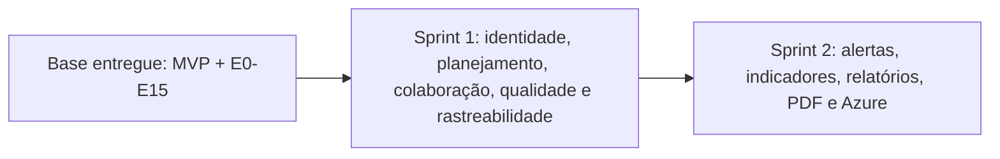
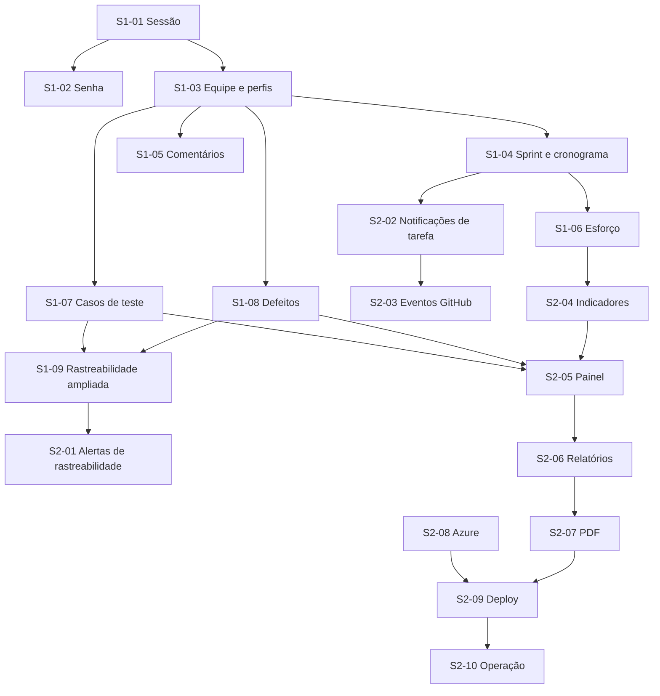

# TRACEFLOW - Roadmap de entrega em duas sprints

> Reorganização do escopo remanescente do TraceFlow após a conclusão da refatoração E0-E15.
>
> **Fontes:** documento oficial do TCC, especialmente o Capítulo 3; estado da branch `main`; matriz técnica `RF -> código -> teste`; documentação arquitetural do repositório.

## 1. Objetivo e regra de organização

O desenvolvimento remanescente será executado em **exatamente duas sprints**, com equilíbrio aproximado de 50% do escopo em cada uma:

- **Sprint 1:** Finalização de Login, Identidade e Acesso; Planejamento e Colaboração; Qualidade e Rastreabilidade Ampliada.
- **Sprint 2:** Alertas e Notificações; Indicadores e Painel Consolidado; Relatórios e PDF; Implementação em servidor Azure.

A base funcional e a refatoração E0-E15 já concluídas são pré-condições, não uma terceira sprint. Atividades de homologação, segurança, privacidade, testes, documentação e rastreabilidade integram os critérios de conclusão dos próprios cartões. Não existe uma frente separada de Consolidação e Validação.

## 2. Princípios de execução

- Nenhum RF é concluído apenas por possuir campos isolados no banco ou na interface.
- Cada fluxo deve incluir, quando aplicável, migration versionada, backend, frontend, autorização, testes e documentação.
- Não são permitidos mocks ou respostas estáticas no caminho de produção.
- Segurança OWASP ASVS, LGPD, acessibilidade, observabilidade e testes são transversais.
- Toda entrega mantém a cadeia `RF -> cartão -> branch/commit -> pull request -> testes -> documentação`.

## 3. Equilíbrio das sprints

| Sprint | Frentes | RFs de entrega | Peso complementar |
|---|---|---:|---|
| Sprint 1 | Identidade e acesso; planejamento e colaboração; qualidade e rastreabilidade | 21 | Novos modelos de sprint, comentários, casos de teste e defeitos |
| Sprint 2 | Alertas; indicadores; painel; relatórios; PDF; Azure | 18 | Infraestrutura, deploy, banco, segredos, observabilidade, backup e operação |

O equilíbrio é aproximado: a Sprint 1 concentra três domínios funcionais e a Sprint 2 combina três domínios funcionais com a implantação completa em Azure.

## 4. Definition of Done comum

Todo cartão funcional somente pode ser movido para concluído quando:

- os RFs e casos de uso relacionados funcionam de ponta a ponta;
- regras, validações e autorização são aplicadas no backend;
- banco, API e interface utilizam o mesmo contrato;
- migrations são novas, versionadas e testadas;
- estados de carregamento, vazio, erro e acesso negado são tratados;
- testes unitários, integração/API, frontend e E2E proporcionais ao risco passam;
- CI permanece verde, sem enfraquecimento de gates;
- impactos OWASP ASVS e LGPD são avaliados;
- documentação e matriz técnica de rastreabilidade são atualizadas;
- não há mocks em produção, segredos versionados ou regressões conhecidas.

---

# SPRINT 1

## 5. Objetivo da Sprint 1

Entregar identidade e acesso homologados, planejamento colaborativo e a cadeia ampliada de qualidade `Requisito -> Tarefa -> Artefato técnico -> Caso de teste -> Defeito`.

**RFs:** RF10, RF23-RF29, RF31-RF35, RF42-RF46 e RF62-RF64.

## 6. Cartões da Sprint 1

### S1-01 - Finalizar cadastro, login e ciclo de sessão

**Requisitos:** RF23 e RF27; UC01 e UC05.  
**Descrição:** homologar cadastro, autenticação, sessão, logout e proteção de rotas a partir da base existente, incluindo a decisão e implementação de sessão persistente prevista no TCC.

**Dependências:** base de autenticação E0-E15; serviço de usuários; proteção CSRF.  
**Entregáveis:** fluxos completos no backend e frontend; política documentada de TTL e revogação; auditoria; testes E2E.

**Critérios de aceite:**

- cadastro, login e logout funcionam pelo navegador;
- rota originalmente solicitada é preservada após login;
- usuário inativo, credencial inválida e sessão expirada recebem tratamento seguro;
- opção de manter sessão ativa é implementada ou removida formalmente da especificação;
- acesso sem sessão e acesso entre projetos são bloqueados no backend;
- múltiplas abas, submissão duplicada e revogação são testadas.

**Checklist técnico:**

- [ ] revisar contratos, cookies, CSRF, TTL e versionamento de sessão;
- [ ] completar backend, frontend e estados de erro;
- [ ] registrar eventos de autenticação sem dados sensíveis;
- [ ] adicionar testes unitários, API e E2E;
- [ ] atualizar documentação e matriz RF.

### S1-02 - Finalizar recuperação e alteração de senha

**Requisitos:** RF28; UC02.  
**Descrição:** concluir recuperação por e-mail e gestão de senha com tokens de uso único, expiração, revogação e provider real no ambiente de homologação.

**Dependências:** S1-01; configuração segura de e-mail.  
**Entregáveis:** solicitação, envio, redefinição e alteração de senha; interface; auditoria; testes.

**Critérios de aceite:**

- token válido funciona uma única vez e tokens inválidos, expirados ou reutilizados falham;
- resposta da solicitação não permite enumeração de usuários;
- troca de senha revoga sessões anteriores conforme política;
- e-mail real é enviado em homologação; capturadores permanecem restritos a testes;
- nenhum token, senha ou cookie é exposto em logs ou interface.

**Checklist técnico:**

- [ ] validar persistência por hash e expiração;
- [ ] configurar provider e variáveis sem versionar segredos;
- [ ] completar telas e feedbacks;
- [ ] testar solicitação, link, troca, revogação e abuso;
- [ ] atualizar documentação operacional e matriz RF.

### S1-03 - Homologar membros, convites e perfis de acesso

**Requisitos:** RF24, RF25 e RF26; UC06 e UC07.  
**Descrição:** concluir vínculo de usuários ao projeto, consulta de equipe, convites e perfis `OWNER`, `MANAGER`, `MEMBER` e `VIEWER` com autorização real no backend.

**Dependências:** S1-01; memberships existentes.  
**Entregáveis:** gestão de equipe e perfis; regras de convite; isolamento por projeto; testes de autorização.

**Critérios de aceite:**

- convite pode ser aceito ou recusado e trata expiração, revogação, duplicidade e reutilização;
- usuários cadastrados e ainda não cadastrados seguem fluxo coerente;
- equipe e perfis são visíveis apenas a membros autorizados;
- alterações sem permissão são bloqueadas no backend;
- o último `OWNER` não pode ser removido ou rebaixado sem transferência válida.

**Checklist técnico:**

- [ ] revisar regras e contratos de membership/invite;
- [ ] completar UI de equipe, convites e perfis;
- [ ] aplicar autorização por projeto e perfil;
- [ ] testar matriz permitir/negar e isolamento;
- [ ] atualizar documentação, auditoria e matriz RF.

### S1-04 - Implementar sprints, cronograma e marcos

**Requisitos:** RF10 e RF35.  
**Descrição:** criar gestão de sprints e cronograma do projeto, com marcos, datas, vínculo de tarefas e evolução reproduzível.

**Dependências:** Project e Task existentes; S1-03 para permissões; integração posterior com S1-06.  
**Entregáveis:** entidade e CRUD de Sprint; marcos; associação de tarefas; visão de cronograma; cálculo de evolução.

**Critérios de aceite:**

- sprint possui projeto, nome, objetivo, início, fim e status;
- tarefa só pode ser associada a sprint do mesmo projeto;
- cronograma apresenta tarefas, sprints, prazos e marcos;
- evolução informa planejado, concluído, percentual e instante de corte;
- tarefas adicionadas ou removidas após o planejamento são identificáveis;
- permissões, fórmulas, fusos e limites de data são testados.

**Checklist técnico:**

- [ ] definir contrato e migration versionada;
- [ ] implementar repository, service, controller, rotas e validação;
- [ ] implementar telas, filtros e associação de tarefas;
- [ ] testar fórmulas, autorização e integridade;
- [ ] documentar API, cálculo e RFs.

### S1-05 - Implementar comentários e histórico nas tarefas

**Requisitos:** RF29 e RF31.  
**Descrição:** permitir comentários persistidos com autoria real e histórico consultável na tarefa.

**Dependências:** S1-01 e S1-03; Task existente.  
**Entregáveis:** modelo de comentário; API; interface; paginação; política de edição/exclusão; auditoria.

**Critérios de aceite:**

- comentário pertence a tarefa e projeto válidos e usa o autor da sessão;
- conteúdo vazio é rejeitado e limites são aplicados;
- histórico apresenta autor, data/hora, ordenação estável e indicação de edição;
- paginação não perde nem duplica registros;
- regra de edição e preservação histórica é documentada;
- acesso entre projetos e ações sem permissão são bloqueados.

**Checklist técnico:**

- [ ] criar migration e índices;
- [ ] implementar camadas de backend e validação;
- [ ] implementar interface e estados;
- [ ] testar autoria, ordenação, paginação e autorização;
- [ ] atualizar API, privacidade e matriz RF.

### S1-06 - Homologar prioridade, estimativa e esforço realizado

**Requisitos:** RF32, RF33 e RF34; integração com RF51.  
**Descrição:** consolidar prioridade acessível, unidade oficial de estimativa e comparação reproduzível entre esforço planejado e realizado.

**Dependências:** Task e responsável existentes; S1-04 para consolidação por sprint.  
**Entregáveis:** contratos validados; interface consistente; fórmulas documentadas; resumo por tarefa e sprint.

**Critérios de aceite:**

- prioridade é consistente em lista, detalhes e Kanban e não depende apenas de cor;
- unidade de esforço é única e exibida em criação, edição e consulta;
- valores negativos ou inválidos são rejeitados;
- diferença absoluta e percentual tratam estimativa zero e ausência de valor;
- comparação funciona por tarefa e, após S1-04, por sprint;
- responsável da tarefa não é confundido com autor de comentário.

**Checklist técnico:**

- [ ] definir unidade e fórmula em decisão documentada;
- [ ] revisar schema e migration se necessário;
- [ ] completar API, formulários e visualização;
- [ ] integrar Sprint, Task e RF51;
- [ ] testar casos extremos, acessibilidade e regressão.

### S1-07 - Cadastrar e gerenciar casos de teste

**Requisito:** RF42.  
**Descrição:** criar casos de teste reais e persistidos com dados suficientes para execução e acompanhamento.

**Dependências:** projeto, membros e autorização; S1-03.  
**Entregáveis:** entidade; CRUD; responsável; status; interface; histórico relevante.

**Critérios de aceite:**

- caso de teste registra título, descrição, pré-condições, passos, resultado esperado, status e responsável;
- campos obrigatórios e transições são validados no backend;
- responsáveis pertencem ao projeto e o isolamento é preservado;
- listas suportam paginação, filtros e estados de UI;
- alterações relevantes são auditáveis.

**Checklist técnico:**

- [ ] modelar entidade, enums, índices e migration;
- [ ] implementar backend completo;
- [ ] implementar interface acessível;
- [ ] adicionar testes de domínio, API e frontend;
- [ ] atualizar contratos e matriz RF.

### S1-08 - Cadastrar e gerenciar defeitos

**Requisito:** RF45.  
**Descrição:** registrar defeitos persistidos com severidade, status, responsável e data de abertura.

**Dependências:** projeto, membros e autorização; S1-03.  
**Entregáveis:** entidade; CRUD; interface; regras de status e severidade; auditoria.

**Critérios de aceite:**

- defeito registra título, descrição, severidade, status, responsável e data de abertura;
- enums, campos obrigatórios e transições são validados no backend;
- responsável precisa ser membro elegível do projeto;
- consulta suporta paginação e filtros úteis;
- histórico preserva as alterações relevantes.

**Checklist técnico:**

- [ ] modelar entidade, relações, índices e migration;
- [ ] implementar backend e autorização;
- [ ] implementar interface e estados;
- [ ] adicionar testes e auditoria;
- [ ] atualizar documentação e matriz RF.

### S1-09 - Ampliar rastreabilidade entre requisitos, testes e defeitos

**Requisitos:** RF43, RF44, RF46, RF62, RF63 e RF64.  
**Descrição:** completar a cadeia direta e reversa entre requisitos, tarefas, artefatos técnicos, casos de teste e defeitos.

**Dependências:** S1-07 e S1-08; núcleo de rastreabilidade existente.  
**Entregáveis:** relações persistidas; APIs de vínculo e consulta; matriz/fluxo visual; integridade e auditoria.

**Critérios de aceite:**

- casos de teste podem ser vinculados a tarefas e requisitos;
- defeitos podem ser vinculados a tarefas, requisitos e casos de teste;
- a consulta de um caso de teste apresenta tarefa e artefatos técnicos relacionados;
- navegação direta e reversa retorna resultados consistentes;
- vínculos entre projetos diferentes são impossíveis;
- criação e remoção registram origem, autor, data e evidência quando aplicável.

**Checklist técnico:**

- [ ] definir relações canônicas e cardinalidades;
- [ ] criar migrations seguras sem duplicar modelos legados;
- [ ] implementar vínculo, remoção e consultas reversas;
- [ ] atualizar matriz e fluxo visual;
- [ ] testar integridade, autorização e regressão ponta a ponta.

## 7. Marco de conclusão da Sprint 1

A Sprint 1 termina quando os 21 RFs estão homologados, as migrações aplicam em banco limpo e atualizado, os fluxos críticos passam em E2E, a cadeia ampliada de rastreabilidade é navegável nos dois sentidos e a documentação reflete o comportamento real.

---

# SPRINT 2

## 8. Objetivo da Sprint 2

Transformar os dados rastreáveis em comunicação proativa, indicadores explicáveis e relatórios auditáveis, disponibilizando o TraceFlow em infraestrutura Azure segura e operável.

**RFs:** RF13, RF15-RF18, RF30, RF36, RF37, RF39, RF40, RF54-RF61.

## 9. Cartões da Sprint 2

### S2-01 - Detectar inconsistências de rastreabilidade e emitir alertas

**Requisitos:** RF13, RF39, RF40 e RF58.  
**Descrição:** detectar tarefas e artefatos técnicos sem vínculos esperados e registrar alertas rastreáveis, deduplicados e acionáveis.

**Dependências:** Sprint 1 concluída; sincronização GitHub e vínculos existentes.  
**Entregáveis:** regras de detecção; persistência; API; interface; contexto e resolução do alerta.

**Critérios de aceite:**

- tarefa concluída sem commit gera alerta com tarefa, tipo e data;
- PR mesclada sem tarefa e issue fechada sem tarefa geram alertas equivalentes;
- tarefas sem commit, PR ou issue podem ser listadas;
- reprocessamento não duplica alertas ativos;
- correção da inconsistência atualiza ou resolve o alerta conforme regra documentada;
- consultas respeitam projeto, perfil e paginação.

**Checklist técnico:**

- [ ] definir eventos, estados e chave de deduplicação;
- [ ] modelar persistência e migration;
- [ ] implementar processamento idempotente e consultas;
- [ ] implementar interface de alertas;
- [ ] testar detecção, concorrência, autorização e resolução.

### S2-02 - Notificar mudança de status e vencimento de tarefa

**Requisitos:** RF30 e RF59.  
**Descrição:** notificar responsáveis por mudança de status e atraso, com preferências, leitura e deduplicação.

**Dependências:** responsáveis RF51; cronograma e datas da Sprint 1; infraestrutura de notificação definida.  
**Entregáveis:** eventos; destinatários; persistência; central de notificações; processamento de vencimento.

**Critérios de aceite:**

- mudança de status notifica o responsável correto com contexto da tarefa;
- tarefa vencida gera uma notificação sem repetição indevida;
- leitura/não leitura e link para o contexto persistem;
- alterações em massa e concorrentes são idempotentes;
- timezone e instante de corte são documentados e testados;
- somente destinatários autorizados visualizam a notificação.

**Checklist técnico:**

- [ ] definir contrato de evento e preferências;
- [ ] criar migration, job seguro e índices;
- [ ] implementar API e interface;
- [ ] configurar scheduler compatível com Azure;
- [ ] testar prazos, fusos, deduplicação e autorização.

### S2-03 - Notificar eventos de issues e pull requests

**Requisitos:** RF60 e RF61.  
**Descrição:** notificar usuários envolvidos quando issues e pull requests vinculadas forem abertas, fechadas ou mescladas.

**Dependências:** sincronização GitHub; rastreabilidade; infraestrutura de S2-02.  
**Entregáveis:** detecção de transições; destinatários; notificações; links para tarefa e artefato.

**Critérios de aceite:**

- abertura/fechamento de issue vinculada gera evento somente após transição real;
- fechamento/merge de PR vinculada gera evento equivalente;
- destinatários são derivados da participação na tarefa e do projeto;
- sincronizações repetidas não duplicam notificações;
- falhas temporárias podem ser reprocessadas sem perda;
- tokens e respostas brutas do GitHub não são expostos.

**Checklist técnico:**

- [ ] mapear transições persistidas da sincronização;
- [ ] implementar outbox/job ou estratégia idempotente equivalente;
- [ ] integrar central de notificações;
- [ ] adicionar observabilidade e retentativas limitadas;
- [ ] testar eventos, duplicidade, falha e autorização.

### S2-04 - Implementar indicadores de progresso e produtividade

**Requisitos:** RF15, RF16, RF17, RF18 e RF36.  
**Descrição:** calcular indicadores reproduzíveis de progresso, commits, tarefas concluídas, retrabalho e produtividade por responsável.

**Dependências:** tarefas, sprints, responsáveis e dados GitHub íntegros; Sprint 1.  
**Entregáveis:** serviços de cálculo; APIs; visualizações; definições e limitações documentadas.

**Critérios de aceite:**

- progresso usa tarefas concluídas sobre total e atualiza após mudança de status;
- commits são contados por usuário e período estritamente na branch `main`;
- tarefas concluídas são contadas por responsável e período;
- retrabalho considera PRs reabertas após fechamento no período;
- métrica por responsável apresenta commits e tarefas sem inferir avaliação humana absoluta;
- fórmulas tratam conjuntos vazios, timezone e filtros de projeto.

**Checklist técnico:**

- [ ] documentar fórmula, fonte, período e limitações de cada indicador;
- [ ] implementar consultas eficientes e serviços puros;
- [ ] criar API e componentes de visualização;
- [ ] testar cálculos, bordas, autorização e desempenho;
- [ ] atualizar matriz RF e documentação de privacidade.

### S2-05 - Implementar qualidade, filtros e painel consolidado

**Requisitos:** RF54, RF55 e RF56.  
**Descrição:** consolidar planejamento, GitHub, rastreabilidade e qualidade em um painel filtrável por período.

**Dependências:** S2-04; casos de teste/defeitos da Sprint 1; dados de revisão de PR.  
**Entregáveis:** indicadores de qualidade; filtro temporal comum; painel consolidado; estados e acessibilidade.

**Critérios de aceite:**

- qualidade apresenta taxa de retrabalho e taxa de aprovação em revisões;
- painel integra planejamento, artefatos e indicadores sem dados mockados;
- filtro de período é aplicado de forma consistente a todos os indicadores compatíveis;
- cada número permite identificar fórmula, fonte e horário de atualização;
- estados vazio, parcial e indisponível não são apresentados como zero;
- consultas respeitam projeto e possuem desempenho aceitável.

**Checklist técnico:**

- [ ] definir contrato agregado e política de cache, se necessária;
- [ ] implementar consultas e APIs;
- [ ] construir painel responsivo e acessível;
- [ ] testar filtros, dados ausentes, cálculo e autorização;
- [ ] documentar métricas e atualizar matriz RF.

### S2-06 - Gerar relatórios resumidos do projeto

**Requisito:** RF37.  
**Descrição:** gerar relatórios reproduzíveis de planejamento, rastreabilidade e indicadores a partir dos dados reais do projeto.

**Dependências:** S2-04 e S2-05; dados da Sprint 1.  
**Entregáveis:** modelo de relatório; filtros; geração; visualização; metadados e auditoria.

**Critérios de aceite:**

- relatório inclui seções de planejamento, rastreabilidade e indicadores;
- período, projeto, data de geração e responsável são registrados;
- números coincidem com as APIs e o painel para os mesmos filtros;
- geração é autorizada e auditada;
- conjuntos grandes possuem estratégia segura de processamento;
- falhas não resultam em relatório incompleto marcado como sucesso.

**Checklist técnico:**

- [ ] definir contrato e snapshot dos dados;
- [ ] implementar serviço de geração e status;
- [ ] implementar visualização e filtros;
- [ ] testar consistência, autorização, volume e falha;
- [ ] documentar API, retenção e matriz RF.

### S2-07 - Exportar relatórios em PDF

**Requisito:** RF57.  
**Descrição:** exportar o relatório de S2-06 como PDF paginado, legível e auditável.

**Dependências:** S2-06; decisão de biblioteca e armazenamento.  
**Entregáveis:** geração de PDF; download autorizado; cabeçalho/rodapé; tabelas e quebras de página; testes de renderização.

**Critérios de aceite:**

- PDF contém o mesmo recorte e dados do relatório de origem;
- páginas possuem identificação do projeto, período, geração e numeração;
- tabelas, gráficos e textos não ficam cortados ou ilegíveis;
- caracteres em português são renderizados corretamente;
- download exige acesso ao projeto e é auditado;
- arquivo temporário/armazenado segue política de retenção e exclusão.

**Checklist técnico:**

- [ ] registrar decisão de biblioteca e estratégia de geração;
- [ ] implementar template e paginação;
- [ ] proteger geração, armazenamento e download;
- [ ] criar testes de conteúdo e renderização;
- [ ] atualizar operação, privacidade e matriz RF.

### S2-08 - Definir arquitetura e provisionar ambiente Azure

**Requisitos relacionados:** suporte operacional a todos os RFs; sem novo RF funcional.  
**Descrição:** definir e provisionar infraestrutura Azure compatível com React/Vite, Node/Express, Prisma e MySQL, com ambientes e configurações reproduzíveis.

**Dependências:** assinatura e permissões Azure; domínio e orçamento definidos; arquitetura atual.  
**Entregáveis:** ADR; diagrama; infraestrutura como código; recursos de aplicação e banco; rede; DNS/TLS; inventário de variáveis.

**Critérios de aceite:**

- frontend, API e MySQL possuem serviços Azure definidos e justificados;
- infraestrutura é reproduzível por IaC e separa homologação de produção;
- banco não fica publicamente exposto sem necessidade;
- HTTPS, CORS e origens são explícitos por ambiente;
- segredos ficam em serviço seguro, nunca no repositório;
- custos, escala, região, backup e limites são documentados.

**Checklist técnico:**

- [ ] criar ADR e diagrama de implantação;
- [ ] escolher serviços Azure e estimar custos;
- [ ] criar IaC e parâmetros por ambiente;
- [ ] configurar rede, DNS, TLS, identidade e segredos;
- [ ] provisionar homologação e validar conectividade.

### S2-09 - Automatizar build, migrations e deploy na Azure

**Requisitos relacionados:** suporte operacional a todos os RFs; sem novo RF funcional.  
**Descrição:** criar entrega contínua com gates, artefatos imutáveis, migrations controladas e rollback verificável.

**Dependências:** S2-08; CI existente verde; credenciais federadas ou identidade gerenciada.  
**Entregáveis:** pipeline de deploy; configuração de runtime; migration job; smoke tests; rollback; runbook.

**Critérios de aceite:**

- deploy só ocorre após lint, testes, build e checks de segurança aprovados;
- autenticação da automação evita segredo estático de longa duração quando suportado;
- migrations usam comando de produção, são registradas e falham de forma segura;
- frontend e API recebem apenas configurações do ambiente correto;
- smoke test valida saúde, banco e fluxo crítico sem dados falsos de produção;
- rollback de aplicação e recuperação de banco possuem procedimento testado.

**Checklist técnico:**

- [ ] criar pipeline de homologação e promoção;
- [ ] configurar build e artefatos imutáveis;
- [ ] automatizar migration com bloqueio e observabilidade;
- [ ] implementar health/readiness e smoke tests;
- [ ] executar e documentar ensaio de rollback.

### S2-10 - Operacionalizar segurança, observabilidade e continuidade na Azure

**Requisitos relacionados:** critérios transversais de segurança, LGPD e operação.  
**Descrição:** concluir monitoramento, logs, alertas operacionais, backup/restore, retenção e resposta a incidentes do ambiente Azure.

**Dependências:** S2-08 e S2-09; inventário de dados e eventos.  
**Entregáveis:** dashboards e alertas; logs correlacionados; backup; teste de restore; políticas; runbooks; evidências de operação.

**Critérios de aceite:**

- aplicação expõe logs estruturados e métricas sem segredos ou dados pessoais desnecessários;
- disponibilidade, erros, latência, banco e jobs possuem alertas acionáveis;
- backups automáticos atendem RPO/RTO documentados;
- restauração é ensaiada e evidenciada;
- retenção, descarte e acessos seguem a política LGPD;
- incidente, indisponibilidade, falha de deploy e comprometimento de segredo possuem runbook.

**Checklist técnico:**

- [ ] configurar telemetria, dashboards e alertas;
- [ ] revisar redaction, retenção e controle de acesso;
- [ ] configurar backup e executar restore de teste;
- [ ] validar ASVS aplicável e dependências;
- [ ] finalizar runbooks e checklist operacional.

## 10. Marco de conclusão da Sprint 2

A Sprint 2 termina quando os 18 RFs estão homologados, os relatórios e PDFs são reproduzíveis, os alertas e indicadores usam dados reais e o TraceFlow está implantado na Azure por pipeline controlada, com TLS, segredos seguros, migrations, monitoramento, backup restaurável e documentação operacional.

---

## 11. Dependências entre cartões

## 12. Cobertura final do escopo remanescente

| Domínio | RFs | Sprint |
|---|---|---|
| Identidade e acesso | RF23-RF28 | Sprint 1 |
| Planejamento e colaboração | RF10, RF29, RF31-RF35 | Sprint 1 |
| Qualidade e rastreabilidade ampliada | RF42-RF46, RF62-RF64 | Sprint 1 |
| Alertas e notificações | RF13, RF30, RF39, RF40, RF58-RF61 | Sprint 2 |
| Indicadores e painel | RF15-RF18, RF36, RF54-RF56 | Sprint 2 |
| Relatórios e PDF | RF37, RF57 | Sprint 2 |
| Implementação em Azure | Infraestrutura, deploy e operação | Sprint 2 |

Total: **39 RFs remanescentes**, todos atribuídos a uma das duas sprints, sem inventar números ausentes e sem criar frentes adicionais.
