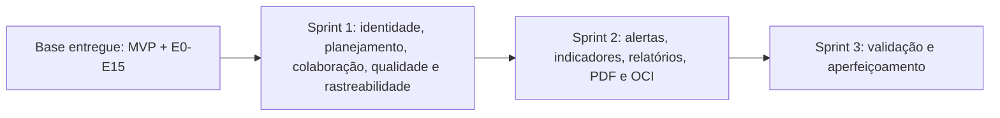
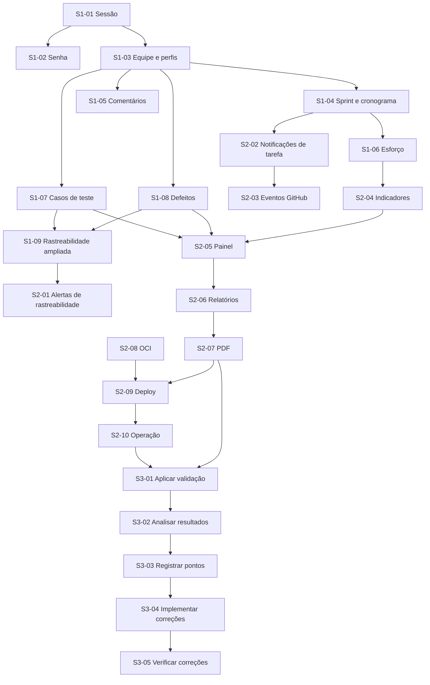

# TRACEFLOW - Roadmap de entrega em três sprints

> Reorganização do escopo remanescente do TraceFlow após a conclusão da refatoração E0-E15.
>
> **Fontes:** documento oficial do TCC, especialmente os Capítulos 3 e 4 e o Apêndice B; estado da branch `main`; matriz técnica `RF -> código -> teste`; documentação arquitetural do repositório.

> **Atualização técnica LR.7 — 21/08/2026:** auditoria na branch `daniel-dev`, baseline
> `59f2628eb6f750f0fc83018f749cee72364d5d64`, após LR.1–LR.6, LR.2.1 e LR.3.1. As LR
> endureceram segurança, legado, GitHub, privacidade, banco e frontend, mas não implementaram os RFs
> futuros das Sprints 1/2; por isso os checklists funcionais abaixo não foram promovidos. Os gates
> locais atuais passaram com 418 testes backend executados, 243 frontend e 39 migrations. SMTP,
> GitHub/webhook reais, viewports em navegador, OCI e operação continuam homologações externas,
> não bugs inferidos.

## 1. Objetivo e regra de organização

O desenvolvimento será organizado em **três sprints**. As Sprints 1 e 2 dividem aproximadamente 50% do escopo de implementação em cada uma; a Sprint 3 ocorre depois delas e é dedicada à validação e ao aperfeiçoamento da ferramenta:

- **Sprint 1:** Finalização de Login, Identidade e Acesso; Planejamento e Colaboração; Qualidade e Rastreabilidade Ampliada.
- **Sprint 2:** Alertas e Notificações; Indicadores e Painel Consolidado; Relatórios e PDF; Implantação em ambiente de nuvem na Oracle Cloud Infrastructure (OCI).
- **Sprint 3:** Validação e aperfeiçoamento da ferramenta, em duas etapas sequenciais: aplicação do Capítulo 4 e correção dos pontos identificados.

A base funcional e a refatoração E0-E15 já concluídas são pré-condições. Segurança, privacidade, testes, documentação e rastreabilidade integram os critérios de conclusão dos próprios cartões. A validação com participantes é executada somente na Sprint 3, após a ferramenta estar implementada e disponível em homologação.

## 2. Princípios de execução

- Nenhum RF é concluído apenas por possuir campos isolados no banco ou na interface.
- Cada fluxo deve incluir, quando aplicável, migration versionada, backend, frontend, autorização, testes e documentação.
- Não são permitidos mocks ou respostas estáticas no caminho de produção.
- Segurança OWASP ASVS, LGPD, acessibilidade, observabilidade e testes são transversais.
- Toda entrega mantém a cadeia `RF -> cartão -> branch/commit -> pull request -> testes -> documentação`.

## 3. Estrutura das sprints

| Sprint | Frentes | RFs de entrega | Peso complementar |
|---|---|---:|---|
| Sprint 1 | Identidade e acesso; planejamento e colaboração; qualidade e rastreabilidade | 21 | Novos modelos de sprint, comentários, casos de teste e defeitos |
| Sprint 2 | Alertas; indicadores; painel; relatórios; PDF; OCI | 18 | Infraestrutura, deploy, banco, segredos, observabilidade, backup e operação |
| Sprint 3 | Validação e aperfeiçoamento | Sem novo RF funcional | Participantes, roteiro, questionário TAM, evidências, correções e verificação |

O equilíbrio de implementação é aproximado: a Sprint 1 concentra três domínios funcionais e a Sprint 2 combina três domínios funcionais com a implantação planejada na Oracle Cloud Infrastructure (OCI). A Sprint 3 não redistribui RFs; ela valida o produto integrado e transforma os achados em correções verificadas.

## 4. Definition of Done comum

Todo cartão funcional somente pode ser movido para concluído quando:

- os RFs e casos de uso relacionados funcionam de ponta a ponta;
- regras, validações e autorização são aplicadas no backend;
- banco, API e interface utilizam o mesmo contrato;
- migrations são novas, versionadas e testadas;
- estados de carregamento, vazio, erro e acesso negado são tratados;
- testes unitários, integração/API, frontend e E2E proporcionais ao risco passam;
- CI permanece verde, sem enfraquecimento de gates;
- impactos OWASP ASVS e LGPD são avaliados;
- documentação e matriz técnica de rastreabilidade são atualizadas;
- não há mocks em produção, segredos versionados ou regressões conhecidas.

---

# SPRINT 1

## 5. Objetivo da Sprint 1

Entregar identidade e acesso homologados, planejamento colaborativo e a cadeia ampliada de qualidade `Requisito -> Tarefa -> Artefato técnico -> Caso de teste -> Defeito`.

**RFs:** RF10, RF23-RF29, RF31-RF35, RF42-RF46 e RF62-RF64.

## 6. Cartões da Sprint 1

### S1-01 - Finalizar cadastro, login e ciclo de sessão

**Requisitos:** RF23 e RF27; UC01.

**Descrição:** homologar cadastro, autenticação, sessão, logout e proteção de rotas a partir da base existente, incluindo a decisão e implementação de sessão persistente prevista no TCC.

**Estado na baseline pós-L5.1/L6.1:** **IMPLEMENTAÇÃO TÉCNICA CONCLUÍDA**. Cadastro, login local, sessão persistente, logout, CSRF, proteção de rotas e retorno ao destino solicitado estão implementados e cobertos por testes automatizados. A validação ponta a ponta com SMTP real e com a autenticação externa do GitHub permanece pendente e não é considerada `PASS` por esta atualização documental.

**Dependências:** base de autenticação E0-E15; serviço de usuários; proteção CSRF.  
**Entregáveis:** fluxos completos no backend e frontend; política documentada de TTL e revogação; auditoria; testes E2E.

**Critérios de aceite:**

- cadastro, login e logout funcionam pelo navegador;
- rota originalmente solicitada é preservada após login;
- usuário inativo, credencial inválida e sessão expirada recebem tratamento seguro;
- opção de manter sessão ativa é implementada ou removida formalmente da especificação;
- acesso sem sessão e acesso entre projetos são bloqueados no backend;
- múltiplas abas, submissão duplicada e revogação são testadas.

**Checklist técnico:**

- [x] revisar contratos, cookies, CSRF, TTL e versionamento de sessão;
- [x] completar backend, frontend e estados de erro;
- [x] registrar eventos de autenticação sem dados sensíveis;
- [x] adicionar testes unitários, API e frontend automatizados;
- [x] atualizar documentação e matriz RF;
- [ ] homologar os fluxos dependentes de SMTP e GitHub em ambiente externo controlado.

### S1-02 - Finalizar recuperação e alteração de senha

**Requisitos:** RF28; UC02.  
**Descrição:** concluir recuperação por e-mail e gestão de senha com tokens de uso único, expiração, revogação e provider real no ambiente de homologação.

**Estado na baseline pós-L5.1/L6.1:** **IMPLEMENTAÇÃO TÉCNICA CONCLUÍDA; HOMOLOGAÇÃO SMTP PENDENTE**. Solicitação uniforme, token hashado, expiração, uso único, redefinição, revogação de sessões, telas e adapter de e-mail estão implementados e cobertos por testes automatizados. O envio e o consumo do link em uma caixa postal real ainda não foram homologados e não são considerados `PASS`.

**Decisão de segurança:** a solicitação de recuperação responde de forma genérica tanto para e-mail cadastrado quanto para e-mail inexistente. Essa divergência do texto literal do UC02 é intencional e impede enumeração de contas.

**Dependências:** S1-01; configuração segura de e-mail.  
**Entregáveis:** solicitação, envio, redefinição e alteração de senha; interface; auditoria; testes.

**Critérios de aceite:**

- token válido funciona uma única vez e tokens inválidos, expirados ou reutilizados falham;
- resposta da solicitação não permite enumeração de usuários;
- troca de senha revoga sessões anteriores conforme política;
- e-mail real é enviado em homologação; capturadores permanecem restritos a testes;
- nenhum token, senha ou cookie é exposto em logs ou interface.

**Checklist técnico:**

- [x] validar persistência por hash e expiração;
- [x] implementar configuração do provider por variáveis sem versionar segredos;
- [x] completar telas e feedbacks;
- [x] testar solicitação, link, troca, revogação e abuso;
- [x] atualizar documentação operacional e matriz RF;
- [ ] homologar entrega e consumo do link com SMTP e caixa postal reais.

### S1-03 - Homologar membros, convites e perfis de acesso

**Requisitos:** RF24, RF25 e RF26; UC05, UC06 e UC07.

**Descrição:** concluir vínculo de usuários ao projeto, consulta de equipe, convites e perfis `OWNER`, `MANAGER`, `MEMBER` e `VIEWER` com autorização real no backend.

**Estado na baseline pós-L5.1/L6.1:** **IMPLEMENTAÇÃO TÉCNICA CONCLUÍDA; HOMOLOGAÇÃO EXTERNA PENDENTE**. A L2.1 consolidou `ProjectMembership`, `ProjectInvitation`, equipe, convites e perfis; a L5.1 acrescentou os convites pessoais do UC05 e, como capacidade adicional ao TCC, ingresso por código/link. Os fluxos estão cobertos por testes automatizados. A entrega de convite por SMTP real e a homologação manual focada da L5.1 permanecem pendentes e não são consideradas `PASS`.

**Decisões de produto:** `OWNER` é um papel contextual ao projeto e **não** representa Administrador do Sistema; nenhuma administração global está implementada. Usuário sem conta não autentica nem acessa a plataforma. Usuário com conta, mas sem `ProjectMembership` ativa, pode autenticar e permanecer sem projetos acessíveis; isso é comportamento correto, não uma lacuna.

**Dependências:** S1-01; memberships existentes.  
**Entregáveis:** gestão de equipe e perfis; regras de convite; isolamento por projeto; testes de autorização.

**Critérios de aceite:**

- convite pode ser aceito ou recusado e trata expiração, revogação, duplicidade e reutilização;
- usuários cadastrados e ainda não cadastrados seguem fluxo coerente;
- equipe e perfis são visíveis apenas a membros autorizados;
- alterações sem permissão são bloqueadas no backend;
- o último `OWNER` não pode ser removido ou rebaixado sem transferência válida.

**Checklist técnico:**

- [x] revisar regras e contratos de membership/invite;
- [x] completar UI de equipe, convites e perfis;
- [x] aplicar autorização por projeto e perfil;
- [x] testar matriz permitir/negar e isolamento;
- [x] atualizar documentação, auditoria e matriz RF;
- [ ] homologar a entrega de convites por SMTP real e os cenários manuais focados da L5.1.

### S1-04 - Implementar sprints, cronograma e marcos

**Requisitos:** RF10 e RF35.  
**Descrição:** criar gestão de sprints e cronograma do projeto, com marcos, datas, vínculo de tarefas e evolução reproduzível.

**Dependências:** Project e Task existentes; S1-03 para permissões; integração posterior com S1-06.  
**Entregáveis:** entidade e CRUD de Sprint; marcos; associação de tarefas; visão de cronograma; cálculo de evolução.

**Critérios de aceite:**

- sprint possui projeto, nome, objetivo, início, fim e status;
- tarefa só pode ser associada a sprint do mesmo projeto;
- cronograma apresenta tarefas, sprints, prazos e marcos;
- evolução informa planejado, concluído, percentual e instante de corte;
- tarefas adicionadas ou removidas após o planejamento são identificáveis;
- permissões, fórmulas, fusos e limites de data são testados.

**Checklist técnico:**

- [x] definir contrato e migration versionada;
- [x] implementar repository, service, controller, rotas e validação;
- [x] implementar telas, filtros e associação de tarefas;
- [x] testar fórmulas, autorização e integridade;
- [x] documentar API, cálculo e RFs.

**Estado:** implementação e documentação concluídas; correções do code review da PR #12
aplicadas e registradas no [ADR-010](docs/architecture/ADR-010-SPRINT-DOMAIN-CORRECTIONS.md).

**Revisão do modelo (23/08/2026).** O desenho de produto exigiu um modelo que o cartão não
sustentava, e o [ADR-011](docs/architecture/ADR-011-MILESTONE-SPRINT-INVERSION.md) registra a
mudança: o marco passou a **agrupar** sprints (invertendo D02), ganhou prazo próprio (revertendo
D11) e deixou de congelar junto com a sprint (restringindo D12). Entraram com ele: sprint única
`EM_ANDAMENTO` por projeto, devolução ao backlog no encerramento, conclusão automática do marco,
burndown no `progress`, filtro do quadro por sprint e o cronograma em calendário. A tela única de
cronograma virou três rotas — `/sprints`, `/milestones` e `/schedule`.

A migration `20260823120000_adr011_invert_milestone_sprint` é **irreversível sem perda**: uma
sprint podia ter vários marcos e passa a apontar para um. `npm run adr011:audit` lista, antes de
aplicar, quais vínculos serão descartados.

**Pendência para homologação plena:** o DoD (§4) pede fluxos ponta a ponta proporcionais ao
risco. As jornadas críticas estão cobertas por teste de API e de interface, mas não por E2E de
navegador — `S104-F02` no backlog técnico. Até que essa decisão seja tomada, o cartão fica
**concluído em implementação, aberto em homologação**.

### S1-05 - Implementar comentários e histórico nas tarefas

**Requisitos:** RF29 e RF31.  
**Descrição:** permitir comentários persistidos com autoria real e histórico consultável na tarefa.

**Dependências:** S1-01 e S1-03; Task existente.  
**Entregáveis:** modelo de comentário; API; interface; paginação; política de edição/exclusão; auditoria.

**Critérios de aceite:**

- comentário pertence a tarefa e projeto válidos e usa o autor da sessão;
- conteúdo vazio é rejeitado e limites são aplicados;
- histórico apresenta autor, data/hora, ordenação estável e indicação de edição;
- paginação não perde nem duplica registros;
- regra de edição e preservação histórica é documentada;
- acesso entre projetos e ações sem permissão são bloqueados.

**Checklist técnico:**

- [x] criar migration e índices;
- [x] implementar camadas de backend e validação;
- [x] implementar interface e estados;
- [x] testar autoria, ordenação, paginação e autorização;
- [x] atualizar API, privacidade e matriz RF.

### S1-06 - Homologar prioridade, estimativa e esforço realizado

**Requisitos:** RF32, RF33 e RF34; integração com RF51.  
**Descrição:** consolidar prioridade acessível, unidade oficial de estimativa e comparação reproduzível entre esforço planejado e realizado.

**Dependências:** Task e responsável existentes; S1-04 para consolidação por sprint.  
**Entregáveis:** contratos validados; interface consistente; fórmulas documentadas; resumo por tarefa e sprint.

**Critérios de aceite:**

- prioridade é consistente em lista, detalhes e Kanban e não depende apenas de cor;
- unidade de esforço é única e exibida em criação, edição e consulta;
- valores negativos ou inválidos são rejeitados;
- diferença absoluta e percentual tratam estimativa zero e ausência de valor;
- comparação funciona por tarefa e, após S1-04, por sprint;
- responsável da tarefa não é confundido com autor de comentário.

**Checklist técnico:**

- [ ] definir unidade e fórmula em decisão documentada;
- [ ] revisar schema e migration se necessário;
- [ ] completar API, formulários e visualização;
- [ ] integrar Sprint, Task e RF51;
- [ ] testar casos extremos, acessibilidade e regressão.

### S1-07 - Cadastrar e gerenciar casos de teste

**Requisito:** RF42.  
**Descrição:** criar casos de teste reais e persistidos com dados suficientes para execução e acompanhamento.

**Dependências:** projeto, membros e autorização; S1-03.  
**Entregáveis:** entidade; CRUD; responsável; status; interface; histórico relevante.

**Critérios de aceite:**

- caso de teste registra título, descrição, pré-condições, passos, resultado esperado, status e responsável;
- campos obrigatórios e transições são validados no backend;
- responsáveis pertencem ao projeto e o isolamento é preservado;
- listas suportam paginação, filtros e estados de UI;
- alterações relevantes são auditáveis.

**Checklist técnico:**

- [ ] modelar entidade, enums, índices e migration;
- [ ] implementar backend completo;
- [ ] implementar interface acessível;
- [ ] adicionar testes de domínio, API e frontend;
- [ ] atualizar contratos e matriz RF.

### S1-08 - Cadastrar e gerenciar defeitos

**Requisito:** RF45.  
**Descrição:** registrar defeitos persistidos com severidade, status, responsável e data de abertura.

**Dependências:** projeto, membros e autorização; S1-03.  
**Entregáveis:** entidade; CRUD; interface; regras de status e severidade; auditoria.

**Critérios de aceite:**

- defeito registra título, descrição, severidade, status, responsável e data de abertura;
- enums, campos obrigatórios e transições são validados no backend;
- responsável precisa ser membro elegível do projeto;
- consulta suporta paginação e filtros úteis;
- histórico preserva as alterações relevantes.

**Checklist técnico:**

- [ ] modelar entidade, relações, índices e migration;
- [ ] implementar backend e autorização;
- [ ] implementar interface e estados;
- [ ] adicionar testes e auditoria;
- [ ] atualizar documentação e matriz RF.

### S1-09 - Ampliar rastreabilidade entre requisitos, testes e defeitos

**Requisitos:** RF43, RF44, RF46, RF62, RF63 e RF64.  
**Descrição:** completar a cadeia direta e reversa entre requisitos, tarefas, artefatos técnicos, casos de teste e defeitos.

**Dependências:** S1-07 e S1-08; núcleo de rastreabilidade existente.  
**Entregáveis:** relações persistidas; APIs de vínculo e consulta; matriz/fluxo visual; integridade e auditoria.

**Critérios de aceite:**

- casos de teste podem ser vinculados a tarefas e requisitos;
- defeitos podem ser vinculados a tarefas, requisitos e casos de teste;
- a consulta de um caso de teste apresenta tarefa e artefatos técnicos relacionados;
- navegação direta e reversa retorna resultados consistentes;
- vínculos entre projetos diferentes são impossíveis;
- criação e remoção registram origem, autor, data e evidência quando aplicável.

**Checklist técnico:**

- [ ] definir relações canônicas e cardinalidades;
- [ ] criar migrations seguras sem duplicar modelos legados;
- [ ] implementar vínculo, remoção e consultas reversas;
- [ ] atualizar matriz e fluxo visual;
- [ ] testar integridade, autorização e regressão ponta a ponta.

## 7. Marco de conclusão da Sprint 1

A Sprint 1 termina quando os 21 RFs estão homologados, as migrações aplicam em banco limpo e atualizado, os fluxos críticos passam em E2E, a cadeia ampliada de rastreabilidade é navegável nos dois sentidos e a documentação reflete o comportamento real.

---

# SPRINT 2

## 8. Objetivo da Sprint 2

Transformar os dados rastreáveis em comunicação proativa, indicadores explicáveis e relatórios auditáveis, disponibilizando o TraceFlow em infraestrutura segura e operável na Oracle Cloud Infrastructure (OCI).

**RFs:** RF13, RF15-RF18, RF30, RF36, RF37, RF39, RF40, RF54-RF61.

## 9. Cartões da Sprint 2

### S2-01 - Detectar inconsistências de rastreabilidade e emitir alertas

**Requisitos:** RF13, RF39, RF40 e RF58.  
**Descrição:** detectar tarefas e artefatos técnicos sem vínculos esperados e registrar alertas rastreáveis, deduplicados e acionáveis.

**Dependências:** Sprint 1 concluída; sincronização GitHub e vínculos existentes.  
**Entregáveis:** regras de detecção; persistência; API; interface; contexto e resolução do alerta.

**Critérios de aceite:**

- tarefa concluída sem commit gera alerta com tarefa, tipo e data;
- PR mesclada sem tarefa e issue fechada sem tarefa geram alertas equivalentes;
- tarefas sem commit, PR ou issue podem ser listadas;
- reprocessamento não duplica alertas ativos;
- correção da inconsistência atualiza ou resolve o alerta conforme regra documentada;
- consultas respeitam projeto, perfil e paginação.

**Checklist técnico:**

- [ ] definir eventos, estados e chave de deduplicação;
- [ ] modelar persistência e migration;
- [ ] implementar processamento idempotente e consultas;
- [ ] implementar interface de alertas;
- [ ] testar detecção, concorrência, autorização e resolução.

### S2-02 - Notificar mudança de status e vencimento de tarefa

**Requisitos:** RF30 e RF59.  
**Descrição:** notificar responsáveis por mudança de status e atraso, com preferências, leitura e deduplicação.

**Dependências:** responsáveis RF51; cronograma e datas da Sprint 1; infraestrutura de notificação definida.  
**Entregáveis:** eventos; destinatários; persistência; central de notificações; processamento de vencimento.

**Critérios de aceite:**

- mudança de status notifica o responsável correto com contexto da tarefa;
- tarefa vencida gera uma notificação sem repetição indevida;
- leitura/não leitura e link para o contexto persistem;
- alterações em massa e concorrentes são idempotentes;
- timezone e instante de corte são documentados e testados;
- somente destinatários autorizados visualizam a notificação.

**Checklist técnico:**

- [ ] definir contrato de evento e preferências;
- [ ] criar migration, job seguro e índices;
- [ ] implementar API e interface;
- [ ] configurar scheduler compatível com o ambiente OCI planejado;
- [ ] testar prazos, fusos, deduplicação e autorização.

### S2-03 - Notificar eventos de issues e pull requests

**Requisitos:** RF60 e RF61.  
**Descrição:** notificar usuários envolvidos quando issues e pull requests vinculadas forem abertas, fechadas ou mescladas.

**Dependências:** sincronização GitHub; rastreabilidade; infraestrutura de S2-02.  
**Entregáveis:** detecção de transições; destinatários; notificações; links para tarefa e artefato.

**Critérios de aceite:**

- abertura/fechamento de issue vinculada gera evento somente após transição real;
- fechamento/merge de PR vinculada gera evento equivalente;
- destinatários são derivados da participação na tarefa e do projeto;
- sincronizações repetidas não duplicam notificações;
- falhas temporárias podem ser reprocessadas sem perda;
- tokens e respostas brutas do GitHub não são expostos.

**Checklist técnico:**

- [ ] mapear transições persistidas da sincronização;
- [ ] implementar outbox/job ou estratégia idempotente equivalente;
- [ ] integrar central de notificações;
- [ ] adicionar observabilidade e retentativas limitadas;
- [ ] testar eventos, duplicidade, falha e autorização.

### S2-04 - Implementar indicadores de progresso e produtividade

**Requisitos:** RF15, RF16, RF17, RF18 e RF36.  
**Descrição:** calcular indicadores reproduzíveis de progresso, commits, tarefas concluídas, retrabalho e produtividade por responsável.

**Dependências:** tarefas, sprints, responsáveis e dados GitHub íntegros; Sprint 1.  
**Entregáveis:** serviços de cálculo; APIs; visualizações; definições e limitações documentadas.

**Critérios de aceite:**

- progresso usa tarefas concluídas sobre total e atualiza após mudança de status;
- commits são contados por usuário e período estritamente na branch `main`;
- tarefas concluídas são contadas por responsável e período;
- retrabalho considera PRs reabertas após fechamento no período;
- métrica por responsável apresenta commits e tarefas sem inferir avaliação humana absoluta;
- fórmulas tratam conjuntos vazios, timezone e filtros de projeto.

**Checklist técnico:**

- [ ] documentar fórmula, fonte, período e limitações de cada indicador;
- [ ] implementar consultas eficientes e serviços puros;
- [ ] criar API e componentes de visualização;
- [ ] testar cálculos, bordas, autorização e desempenho;
- [ ] atualizar matriz RF e documentação de privacidade.

### S2-05 - Implementar qualidade, filtros e painel consolidado

**Requisitos:** RF54, RF55 e RF56.  
**Descrição:** consolidar planejamento, GitHub, rastreabilidade e qualidade em um painel filtrável por período.

**Dependências:** S2-04; casos de teste/defeitos da Sprint 1; dados de revisão de PR.  
**Entregáveis:** indicadores de qualidade; filtro temporal comum; painel consolidado; estados e acessibilidade.

**Critérios de aceite:**

- qualidade apresenta taxa de retrabalho e taxa de aprovação em revisões;
- painel integra planejamento, artefatos e indicadores sem dados mockados;
- filtro de período é aplicado de forma consistente a todos os indicadores compatíveis;
- cada número permite identificar fórmula, fonte e horário de atualização;
- estados vazio, parcial e indisponível não são apresentados como zero;
- consultas respeitam projeto e possuem desempenho aceitável.

**Checklist técnico:**

- [ ] definir contrato agregado e política de cache, se necessária;
- [ ] implementar consultas e APIs;
- [ ] construir painel responsivo e acessível;
- [ ] testar filtros, dados ausentes, cálculo e autorização;
- [ ] documentar métricas e atualizar matriz RF.

### S2-06 - Gerar relatórios resumidos do projeto

**Requisito:** RF37.  
**Descrição:** gerar relatórios reproduzíveis de planejamento, rastreabilidade e indicadores a partir dos dados reais do projeto.

**Dependências:** S2-04 e S2-05; dados da Sprint 1.  
**Entregáveis:** modelo de relatório; filtros; geração; visualização; metadados e auditoria.

**Critérios de aceite:**

- relatório inclui seções de planejamento, rastreabilidade e indicadores;
- período, projeto, data de geração e responsável são registrados;
- números coincidem com as APIs e o painel para os mesmos filtros;
- geração é autorizada e auditada;
- conjuntos grandes possuem estratégia segura de processamento;
- falhas não resultam em relatório incompleto marcado como sucesso.

**Checklist técnico:**

- [ ] definir contrato e snapshot dos dados;
- [ ] implementar serviço de geração e status;
- [ ] implementar visualização e filtros;
- [ ] testar consistência, autorização, volume e falha;
- [ ] documentar API, retenção e matriz RF.

### S2-07 - Exportar relatórios em PDF

**Requisito:** RF57.  
**Descrição:** exportar o relatório de S2-06 como PDF paginado, legível e auditável.

**Dependências:** S2-06; decisão de biblioteca e armazenamento.  
**Entregáveis:** geração de PDF; download autorizado; cabeçalho/rodapé; tabelas e quebras de página; testes de renderização.

**Critérios de aceite:**

- PDF contém o mesmo recorte e dados do relatório de origem;
- páginas possuem identificação do projeto, período, geração e numeração;
- tabelas, gráficos e textos não ficam cortados ou ilegíveis;
- caracteres em português são renderizados corretamente;
- download exige acesso ao projeto e é auditado;
- arquivo temporário/armazenado segue política de retenção e exclusão.

**Checklist técnico:**

- [ ] registrar decisão de biblioteca e estratégia de geração;
- [ ] implementar template e paginação;
- [ ] proteger geração, armazenamento e download;
- [ ] criar testes de conteúdo e renderização;
- [ ] atualizar operação, privacidade e matriz RF.

### S2-08 - Definir arquitetura e provisionar ambiente na OCI

**Requisitos relacionados:** suporte operacional a todos os RFs; sem novo RF funcional.  
**Descrição:** definir e provisionar infraestrutura na Oracle Cloud Infrastructure (OCI), preferencialmente elegível ao Oracle Cloud Free Tier / Always Free, compatível com React/Vite, Node/Express, Prisma e MySQL. A arquitetura de referência planeja uma VM de aplicação com Nginx, frontend React e backend Node.js e uma VM de dados com MySQL, conectadas por rede privada; a ADR deve confirmar a topologia final conforme capacidade, custos e disponibilidade.

**Dependências:** conta e permissões OCI; disponibilidade e limites do Free Tier / Always Free na região escolhida; domínio e orçamento definidos; arquitetura atual.  
**Entregáveis:** ADR; diagrama; infraestrutura como código; recursos de computação e armazenamento; rede privada; DNS/TLS; regras de firewall; inventário de variáveis e URLs da GitHub App.

**Critérios de aceite:**

- serviços OCI para aplicação e MySQL são definidos e justificados, incluindo a elegibilidade pretendida ao Free Tier / Always Free;
- a topologia final é registrada em ADR; quando adotadas duas VMs, a VM de aplicação executa Nginx, React e Node.js, e a VM de dados executa MySQL;
- infraestrutura é reproduzível por IaC e separa homologação de produção;
- MySQL aceita conexões pela rede privada e não fica publicamente exposto sem necessidade;
- HTTPS, CORS, origens, variáveis de ambiente e regras de firewall são explícitos por ambiente;
- URLs, callbacks e webhooks da GitHub App são atualizados para o domínio de implantação;
- segredos ficam em mecanismo seguro, nunca no repositório;
- custos, escala, região, armazenamento, backup e limites da OCI são documentados.

**Checklist técnico:**

- [ ] criar ADR e diagrama da implantação planejada;
- [ ] validar elegibilidade e capacidade do Free Tier / Always Free e estimar custos excedentes;
- [ ] criar IaC e parâmetros por ambiente;
- [ ] configurar VCN, sub-redes, rede privada, firewall, DNS, TLS, identidade e segredos;
- [ ] configurar inventário de variáveis, URLs, callbacks e webhooks da GitHub App;
- [ ] provisionar homologação e validar conectividade entre aplicação e MySQL.

### S2-09 - Automatizar build, migrations e deploy na OCI

**Requisitos relacionados:** suporte operacional a todos os RFs; sem novo RF funcional.  
**Descrição:** criar entrega contínua para o ambiente OCI com gates, artefatos imutáveis, migrations controladas e rollback verificável.

**Dependências:** S2-08; CI existente verde; acesso seguro às instâncias e credenciais OCI de menor privilégio.  
**Entregáveis:** pipeline de deploy; configuração de Nginx e runtime Node.js; publicação do frontend; migration job do MySQL; smoke tests; rollback; runbook.

**Critérios de aceite:**

- deploy só ocorre após lint, testes, build e checks de segurança aprovados;
- autenticação da automação evita segredo estático de longa duração quando suportado;
- migrations usam comando de produção, são registradas e falham de forma segura;
- frontend e API recebem apenas variáveis e URLs do ambiente correto;
- Nginx publica o frontend por HTTPS e encaminha as requisições da API para o backend Node.js;
- smoke test valida saúde, conexão privada com o MySQL e fluxo crítico sem dados falsos de produção;
- rollback de aplicação e recuperação de banco possuem procedimento testado.

**Checklist técnico:**

- [ ] criar pipeline de homologação e promoção;
- [ ] configurar build, artefatos imutáveis, Nginx e runtime Node.js;
- [ ] automatizar migration com bloqueio e observabilidade;
- [ ] atualizar e validar URLs, callbacks e webhooks da GitHub App;
- [ ] implementar health/readiness e smoke tests;
- [ ] executar e documentar ensaio de rollback.

### S2-10 - Operacionalizar segurança, observabilidade e continuidade na OCI

**Requisitos relacionados:** critérios transversais de segurança, LGPD e operação.  
**Descrição:** concluir monitoramento, logs, alertas operacionais, firewall, backup/restore, retenção e resposta a incidentes do ambiente OCI.

**Dependências:** S2-08 e S2-09; inventário de dados e eventos.  
**Entregáveis:** dashboards e alertas; logs correlacionados; regras de firewall; backup do MySQL e volumes; teste de restore; políticas; runbooks; evidências de operação.

**Critérios de aceite:**

- aplicação expõe logs estruturados e métricas sem segredos ou dados pessoais desnecessários;
- disponibilidade, erros, latência, banco e jobs possuem alertas acionáveis;
- regras de firewall seguem menor privilégio e a VM de dados aceita MySQL somente pela rede privada necessária;
- backups automáticos atendem RPO/RTO documentados;
- restauração do MySQL e dos dados persistentes é ensaiada e evidenciada;
- retenção, descarte e acessos seguem a política LGPD;
- incidente, indisponibilidade, falha de deploy e comprometimento de segredo possuem runbook.

**Checklist técnico:**

- [ ] configurar telemetria, dashboards e alertas;
- [ ] revisar redaction, retenção e controle de acesso;
- [ ] revisar firewall e exposição pública das instâncias;
- [ ] configurar backups e executar restore de teste;
- [ ] validar ASVS aplicável e dependências;
- [ ] finalizar runbooks e checklist operacional.

## 10. Marco de conclusão da Sprint 2

A Sprint 2 termina quando os 18 RFs estão homologados, os relatórios e PDFs são reproduzíveis, os alertas e indicadores usam dados reais e o TraceFlow está implantado na Oracle Cloud Infrastructure (OCI) por pipeline controlada, com TLS, segredos seguros, migrations, rede privada para o MySQL, monitoramento, backup restaurável e documentação operacional.

---

# SPRINT 3 - VALIDAÇÃO E APERFEIÇOAMENTO DA FERRAMENTA

## 11. Objetivo e pré-condições da Sprint 3

Executar o processo de validação definido no Capítulo 4 e no Apêndice B do TCC, analisar as evidências produzidas e corrigir os pontos identificados. A Sprint 3 começa somente após a conclusão das Sprints 1 e 2.

**Pré-condições obrigatórias:**

- ferramenta implementada e hospedada em ambiente de homologação acessível pela web;
- integração com a API do GitHub funcional;
- banco de homologação populado com projeto de exemplo e dados não sensíveis;
- fluxo central e painel de indicadores disponíveis;
- credenciais, roteiro/tutorial e formulário de avaliação preparados;
- participantes selecionados entre Desenvolvedores, Tech Leads e profissionais de QA;
- instrumentos de consentimento, privacidade e tratamento dos dados da pesquisa definidos.

## 12. Duas etapas e ordem obrigatória

### Etapa 1 - Aplicação do Capítulo 4 - Validação da ferramenta

Preparar a aplicação, selecionar os participantes, executar remotamente o roteiro padronizado, coletar as respostas do questionário TAM e organizar os resultados funcionais e perceptivos.

### Etapa 2 - Correção dos pontos identificados

Consolidar os achados em itens rastreáveis, implementar correções e melhorias priorizadas e verificar que os problemas foram resolvidos sem regressões.

Nenhuma correção começa antes do registro dos pontos identificados. Nenhum ponto é encerrado sem verificação da correção e evidência de não regressão.

## 13. Cartões da Sprint 3

### S3-01 - Aplicar a validação do Capítulo 4

**Etapa:** 1 - Aplicação do Capítulo 4.  
**Referências:** Capítulo 4, seções 4.1 a 4.3; Apêndice B.  
**Descrição:** preparar e executar a validação remota com participantes das personas-alvo, usando o mesmo ambiente, roteiro e instrumentos para todos.

**Dependências:** Sprints 1 e 2 concluídas; ambiente OCI de homologação; GitHub funcional; projeto de exemplo; instrumentos aprovados.  
**Entregáveis:** plano e agenda; lista codificada de participantes; ambiente e dados; tutorial; roteiro; questionário TAM; registros de execução; respostas brutas protegidas.

**Atividades obrigatórias do roteiro:**

1. acessar o ambiente e autenticar;
2. cadastrar projeto e repositório GitHub de teste;
3. cadastrar requisito funcional;
4. criar tarefa e vinculá-la ao requisito;
5. sincronizar commits e pull requests;
6. vincular commit à tarefa e consultar a rastreabilidade;
7. concluir a tarefa e consultar indicadores.

**Critérios de aceite:**

- critérios de seleção, quantidade planejada e perfis dos participantes estão documentados;
- todos recebem as mesmas instruções e executam o mesmo fluxo-base;
- sucesso, dificuldade, abandono e observações de cada atividade são registrados;
- questionário usa escala Likert de 5 pontos e contempla utilidade, facilidade de uso e intenção de uso futuro;
- respostas são coletadas sem expor credenciais ou dados pessoais desnecessários;
- desvios, incidentes e limitações da aplicação são registrados.

**Checklist técnico:**

- [ ] validar ambiente, integração, projeto de exemplo e credenciais;
- [ ] revisar tutorial, roteiro, formulário e política de dados;
- [ ] selecionar e agendar Desenvolvedores, Tech Leads e QA;
- [ ] executar sessões e coletar evidências padronizadas;
- [ ] armazenar respostas e registros com acesso restrito.

### S3-02 - Analisar os resultados da validação

**Etapa:** 1 - Aplicação do Capítulo 4.  
**Referências:** Capítulo 4, seções 4.4 e 4.5; Apêndice B.  
**Descrição:** analisar as respostas TAM e a conclusão das tarefas do roteiro para avaliar aceitação, usabilidade e adequação funcional.

**Dependências:** S3-01 concluído; conjunto de respostas fechado e anonimizado/codificado.  
**Entregáveis:** base tabulada; médias por dimensão e item; resultados por atividade; síntese qualitativa; limitações e evidências.

**Critérios de aceite:**

- respostas Likert são tabuladas sem alterar os dados originais;
- médias de Utilidade Percebida, Facilidade de Uso Percebida e Intenção de Uso Futuro são calculadas de forma reproduzível;
- conclusão do fluxo central é analisada por etapa do roteiro;
- dificuldades, inconsistências, sugestões e observações abertas são categorizadas;
- resultados são apresentados de forma agregada, sem identificar indevidamente participantes;
- limitações, ausências e amostra efetiva são declaradas.

**Checklist técnico:**

- [ ] fechar, preservar e versionar o conjunto de respostas;
- [ ] tabular Likert e calcular médias por item/dimensão;
- [ ] consolidar sucesso e dificuldade por atividade;
- [ ] categorizar observações qualitativas;
- [ ] revisar cálculos, privacidade e limitações.

### S3-03 - Registrar e priorizar os pontos identificados

**Etapa:** transição entre a aplicação e a correção.  
**Descrição:** converter os resultados da validação em pontos rastreáveis, distinguindo defeitos, problemas de uso, inconsistências e sugestões.

**Dependências:** S3-02 concluído.  
**Entregáveis:** registro consolidado de achados; evidências; classificação; prioridade; responsável; decisão e vínculo com os cards de correção.

**Critérios de aceite:**

- todo achado possui identificador, descrição, origem e evidência anonimizada;
- itens são classificados como problema funcional, dificuldade de uso, inconsistência, sugestão ou outro tipo justificado;
- severidade, frequência, impacto e prioridade são registrados;
- duplicidades são consolidadas sem perder a origem;
- itens não implementados possuem decisão e justificativa transparentes;
- cada item aprovado para correção possui critério de aceite e responsável.

**Checklist técnico:**

- [ ] criar registro único dos achados;
- [ ] anexar evidência e contexto sem dados pessoais desnecessários;
- [ ] classificar severidade, frequência, impacto e tipo;
- [ ] priorizar e atribuir responsáveis;
- [ ] definir aceite e vínculo de cada correção.

### S3-04 - Implementar as correções e melhorias priorizadas

**Etapa:** 2 - Correção dos pontos identificados.  
**Descrição:** corrigir defeitos, dificuldades de uso e inconsistências priorizadas, implementando somente melhorias justificadas pelas evidências da validação.

**Dependências:** S3-03 concluído; itens priorizados e critérios aprovados.  
**Entregáveis:** código, migrations quando necessárias, testes de regressão, documentação, pull requests e atualização dos registros de achado.

**Critérios de aceite:**

- cada alteração referencia o ponto identificado e os RFs afetados;
- correções preservam contratos, autorização, segurança e integridade dos dados;
- mudanças de schema usam migration versionada e testada;
- problemas funcionais recebem teste de regressão;
- mudanças de usabilidade são verificáveis e acessíveis;
- CI permanece verde e não são introduzidos mocks em produção;
- itens adiados ou rejeitados mantêm decisão e justificativa.

**Checklist técnico:**

- [ ] implementar em branches e PRs pequenos e rastreáveis;
- [ ] atualizar backend, frontend e banco de forma coerente;
- [ ] adicionar testes de regressão e segurança proporcionais ao risco;
- [ ] atualizar documentação, matriz RF e registros de achado;
- [ ] publicar versão corrigida em homologação.

### S3-05 - Verificar as correções realizadas

**Etapa:** 2 - Correção dos pontos identificados.  
**Descrição:** confirmar que as correções atendem aos critérios definidos, não causam regressões e resolvem os achados observados na validação.

**Dependências:** S3-04 concluído; versão corrigida em homologação.  
**Entregáveis:** plano de reteste; evidências antes/depois; resultados automatizados e manuais; situação final de cada achado; limitações residuais.

**Critérios de aceite:**

- cada ponto corrigido é retestado contra seu critério de aceite e evidência original;
- fluxo central do Apêndice B é reexecutado na versão corrigida;
- testes automatizados, integração e E2E passam;
- segurança, autorização, rastreabilidade, relatórios e deploy não apresentam regressão conhecida;
- achados são encerrados, reabertos ou mantidos pendentes com justificativa;
- resultados finais e limitações residuais são documentados para o TCC.

**Checklist técnico:**

- [ ] montar matriz ponto -> correção -> teste -> evidência;
- [ ] executar retestes específicos e suíte de regressão;
- [ ] reexecutar o fluxo central do Apêndice B;
- [ ] revisar achados reabertos e limitações residuais;
- [ ] consolidar evidências e atualizar o texto de validação do TCC.

## 14. Marco de conclusão da Sprint 3

A Sprint 3 termina somente quando a validação foi aplicada, os resultados foram analisados, todos os pontos foram registrados e decididos, as correções priorizadas foram implementadas e cada correção realizada foi verificada com evidência. Pendências residuais permanecem explicitamente documentadas.

---

## 15. Dependências entre cartões

## 16. Cobertura final do escopo remanescente

| Domínio | RFs | Sprint |
|---|---|---|
| Identidade e acesso | RF23-RF28 | Sprint 1 |
| Planejamento e colaboração | RF10, RF29, RF31-RF35 | Sprint 1 |
| Qualidade e rastreabilidade ampliada | RF42-RF46, RF62-RF64 | Sprint 1 |
| Alertas e notificações | RF13, RF30, RF39, RF40, RF58-RF61 | Sprint 2 |
| Indicadores e painel | RF15-RF18, RF36, RF54-RF56 | Sprint 2 |
| Relatórios e PDF | RF37, RF57 | Sprint 2 |
| Implantação na Oracle Cloud Infrastructure (OCI) | Infraestrutura, deploy e operação | Sprint 2 |
| Validação e aperfeiçoamento | Capítulo 4 e Apêndice B; sem novo RF funcional | Sprint 3 |

Total: **39 RFs remanescentes** distribuídos entre as Sprints 1 e 2. A Sprint 3 valida o produto integrado e executa as correções derivadas das evidências, sem inventar novos RFs.
