# TRACEFLOW — Roadmap completo e incremental atualizado

> Plano de evolução do TraceFlow após a conclusão da refatoração E0–E15.
>
> **Estado de referência:** branch `main`, após o merge da E15.
>
> **Fontes consideradas:** documento oficial do TCC, especialmente o Capítulo 3; estado atual do repositório; matriz técnica `RF → código → teste`; documentação arquitetural e relatório final da E15.

## 1. Objetivo desta atualização

Este roadmap substitui a versão anterior e reorganiza o desenvolvimento do TraceFlow a partir do estado real do produto.

A refatoração E0–E15 foi concluída e deixa de aparecer como etapa futura. Seus resultados passam a compor a **base técnica entregue**.

As próximas entregas prioritárias serão executadas em paralelo:

1. **Finalização de Login, Identidade e Acesso — Daniel**
2. **Planejamento e Colaboração — João e Gabriel Trevisan (GT)**

Após essas duas entregas, o roadmap continua com qualidade e rastreabilidade ampliada, alertas, indicadores, relatórios e preparação para validação.

---

## 2. Como interpretar este roadmap

- `ENTREGUE`: fluxo disponível no produto e sustentado por código, persistência, interface e testes.
- `PARCIAL`: existe base funcional relevante, mas o requisito ainda não está homologado integralmente contra o TCC.
- `PRÓXIMA ENTREGA`: item priorizado para o próximo ciclo.
- `FUTURO`: item planejado para incrementos posteriores.
- Nenhum RF deve ser considerado concluído apenas porque existem campos isolados no banco ou na interface.
- Cada RF concluído deve manter rastreabilidade entre requisito, tarefa, código, pull request, testes e documentação.
- Não são permitidos mocks no caminho de produção.
- Segurança, autorização, LGPD, testes e CI permanecem critérios transversais.
- A numeração oficial possui lacunas: RF14, RF19, RF20 e RF47 não estão definidos e não foram inventados.

---

## 3. Visão geral atualizada

```mermaid
flowchart LR
    BASE["Base entregue<br/>Núcleo do MVP + E0–E15"]
    LOGIN["Entrega A<br/>Finalização de Login e Acesso<br/>Daniel"]
    PLAN["Entrega B<br/>Planejamento e Colaboração<br/>João + GT"]
    QUAL["3. Qualidade e rastreabilidade ampliada"]
    ALERT["4. Alertas e notificações"]
    IND["5. Indicadores e painel"]
    REL["6. Relatórios e exportação"]
    PROD["7. Consolidação e validação"]
    UX["8. Face lift<br/>Opcional"]

    BASE --> LOGIN
    BASE --> PLAN
    LOGIN -. "homologação de identidade e permissões" .-> PLAN
    LOGIN --> QUAL
    PLAN --> QUAL
    QUAL --> ALERT --> IND --> REL --> PROD
    LOGIN -.-> UX
    PLAN -.-> UX
    UX -. "não bloqueia" .-> PROD

    classDef done fill:#285943,color:#fff,stroke:#163b2a,stroke-width:2px;
    classDef priority fill:#17324d,color:#fff,stroke:#0b1f33,stroke-width:2px;
    classDef delivery fill:#e8f0f7,color:#17202a,stroke:#315b7d;
    classDef optional fill:#f3f4f6,color:#1f2937,stroke:#6b7280,stroke-width:2px,stroke-dasharray:5 5;

    class BASE done;
    class LOGIN,PLAN priority;
    class QUAL,ALERT,IND,REL,PROD delivery;
    class UX optional;
```

---

## 4. Tabela-resumo

| Ordem | Iniciativa | Responsável | RFs principais | Estado | Saída esperada |
|---:|---|---|---|---|---|
| Base | Núcleo funcional e refatoração E0–E15 | Equipe, com execução principal de Daniel na refatoração | RF01–RF09, RF11, RF12, RF21, RF22, RF38, RF41, RF48–RF53; base de RF23–RF28 | ENTREGUE / BASE ESTÁVEL | Arquitetura, segurança, CI, GitHub, tarefas e rastreabilidade consolidados |
| A | Finalização de Login, Identidade e Acesso — L1 | Daniel | RF23–RF28 | IMPLEMENTADA; HOMOLOGAÇÃO EXTERNA PENDENTE | Cadastro/username, login por identificador, sessão persistente, verificação e recuperação; SMTP real ainda requer ambiente |
| B | Planejamento e Colaboração | João + GT | RF10, RF29, RF31–RF35; integração com RF51 | PARCIAL / NÃO IMPLEMENTADO → PRÓXIMA ENTREGA | Cronograma, sprints, esforço e colaboração incorporados às tarefas |
| 3 | Qualidade e rastreabilidade ampliada | A definir | RF42–RF46, RF62–RF64 | FUTURO | Casos de teste e defeitos conectados à rastreabilidade |
| 4 | Alertas e notificações | A definir | RF13, RF30, RF39, RF40, RF58–RF61 | FUTURO | Inconsistências e eventos comunicados aos usuários |
| 5 | Indicadores e painel consolidado | A definir | RF15–RF18, RF34–RF36, RF54–RF56 | FUTURO | Métricas de progresso, esforço, produtividade e qualidade |
| 6 | Relatórios e PDF | A definir | RF37, RF57 | FUTURO | Relatórios reproduzíveis e exportáveis |
| 7 | Consolidação e validação | Equipe | Qualidade transversal | FUTURO | Versão pronta para homologação e validação do TCC |
| 8 | Face lift | A definir | Sem RF direto | OPCIONAL | Identidade visual consistente sem alterar regras de negócio |

---

# PARTE I — O QUE JÁ FOI ENTREGUE

## 5. Base funcional entregue

### Projetos e GitHub

- cadastro e edição de projetos;
- integração com repositório GitHub;
- importação de commits, pull requests e issues;
- sincronização manual;
- consulta dos artefatos importados;
- sincronização das pull requests da branch principal;
- paginação, deduplicação e tratamento de falhas da API.

**RFs associados:** RF01, RF02, RF03, RF04, RF05, RF06, RF21, RF22 e RF50.

### Tarefas e Kanban

- cadastro, edição, consulta e exclusão de tarefas;
- quadro Kanban com `A Fazer`, `Em Andamento` e `Concluído`;
- movimentação atômica;
- registro de usuário e data das movimentações;
- prioridade, prazo e campos de esforço disponíveis como base;
- responsável associado a usuário ativo do projeto;
- histórico de status, prazo, responsável e prioridade.

**RFs associados:** RF07, RF08, RF38 e RF51.

### Rastreabilidade

- requisito relacionado a tarefa;
- tarefa relacionada a commit, pull request e issue;
- consulta por requisito e tarefa;
- consulta reversa por artefato técnico;
- sugestão automática de vínculo quando o commit utiliza `[TASK-<ID>]`;
- confirmação ou rejeição antes da criação do vínculo.

**RFs associados:** RF09, RF11, RF12, RF41, RF48, RF49, RF52 e RF53.

### Identidade e acesso já existentes como base

- cadastro;
- autenticação com e-mail e senha;
- sessão server-side e cookie;
- proteção CSRF;
- consulta da sessão atual;
- logout;
- solicitação e redefinição de senha;
- convite e aceite;
- membership por projeto;
- perfis `OWNER`, `MANAGER`, `MEMBER` e `VIEWER`;
- consulta da equipe;
- alteração de perfil;
- autorização por projeto.

Esses recursos constituem uma base relevante para RF23–RF28, mas a entrega será tratada como **parcial** até a homologação completa descrita na Entrega A.

---

## 6. Refatoração E0–E15 — concluída e removida das próximas etapas

A refatoração não é mais uma iniciativa futura do roadmap.

### Resultados incorporados à base

- arquitetura backend `Route → Controller → Service → Repository → Prisma`;
- frontend organizado por domínio;
- contratos, validações, erros e logs padronizados;
- autenticação e autorização por projeto;
- trilha de auditoria e controles técnicos de privacidade;
- modelo canônico de rastreabilidade;
- remoção controlada de estruturas redundantes;
- migrations versionadas;
- testes unitários, de integração e frontend;
- lint, formatação, cobertura e build;
- CI com gates obrigatórios;
- análise de dependências e Dependency Review;
- documentação de arquitetura, API, segurança, LGPD e operação;
- runbooks de GitHub, banco, backup e incidentes;
- proteção da `main` por pull request e checks.

**Situação:** `E0–E15 — CONCLUÍDA COM RESSALVAS DOCUMENTADAS`.

As ressalvas operacionais e de produto permanecem no backlog técnico, mas não impedem as próximas funcionalidades.

---

# PARTE II — PRÓXIMAS DUAS ENTREGAS

# Entrega A — Finalização de Login, Identidade e Acesso

**Responsável:** Daniel  
**Prioridade:** imediata  
**RFs:** RF23, RF24, RF25, RF26, RF27 e RF28  
**Casos de uso relacionados:** UC01, UC02, UC05, UC06 e UC07  
**Estado atual:** L1 implementada no produto e coberta por testes automatizados; homologação com SMTP/GitHub App reais e E2E externo permanecem pendentes

## 7. Objetivo

Finalizar a jornada de identidade e acesso para que cadastro, autenticação, recuperação de senha, sessão, convites, equipe e perfis funcionem de ponta a ponta em uma experiência coerente, segura e validada.

A entrega não deve reconstruir a autenticação existente. O trabalho deve partir da base atual, corrigir lacunas e homologar o conjunto.

## 8. O que já existe

- endpoints de cadastro, login, sessão, CSRF, logout, recuperação, redefinição e alteração de senha;
- páginas de login, cadastro, recuperação e redefinição;
- rota protegida;
- sessão persistida no backend;
- hash de senha com Argon2id;
- tokens de recuperação armazenados por hash;
- convite e aceite de convite;
- memberships e perfis;
- consulta e gestão da equipe.

## 9. Escopo de Daniel

### 9.1 Homologar cadastro e autenticação — RF23 e RF27

- revisar o fluxo completo de cadastro;
- validar redirecionamento após cadastro e login;
- preservar a rota solicitada antes da autenticação;
- validar conta inativa;
- garantir logout e encerramento correto da sessão;
- tratar sessão expirada na interface;
- revisar comportamento em múltiplas abas;
- impedir acesso a rotas privadas sem sessão válida;
- validar isolamento entre projetos;
- revisar loading, erros e submissões duplicadas.

### 9.2 Finalizar “manter sessão ativa” do UC01

O UC01 prevê a alternativa **Manter sessão ativa**, mas o formulário atual não apresenta essa opção.

- definir TTL da sessão comum e persistente;
- adicionar a opção na tela;
- enviar a preferência ao backend;
- aplicar cookie e expiração coerentes;
- manter revogação e versionamento de sessão;
- adicionar testes.

Caso a equipe decida não implementar, a decisão deve ser registrada e a especificação do TCC atualizada.

### 9.3 Finalizar recuperação de senha — RF28 e UC02

- validar token válido, expirado, reutilizado e inválido;
- revogar sessões após a troca;
- configurar envio real de e-mail em homologação;
- manter provider de captura apenas para testes;
- validar link e expiração;
- evitar enumeração de usuários;
- alinhar mensagens do TCC à política de segurança;
- testar o fluxo completo no navegador.

### 9.4 Finalizar gestão da conta

- disponibilizar interface de alteração de senha;
- confirmar invalidação de sessões anteriores;
- apresentar feedback de sucesso e erro;
- revisar dados básicos exibidos;
- impedir exposição de credenciais ou tokens.

### 9.5 Homologar usuários, equipe e perfis — RF24, RF25 e RF26

- revisar convite, aceite e recusa;
- validar convite expirado, revogado, duplicado e usado;
- tratar usuário cadastrado e não cadastrado;
- revisar consulta da equipe e alteração de perfil;
- impedir alterações sem permissão;
- definir proteção do último `OWNER`;
- validar os papéis no backend;
- garantir que a UI não seja tratada como autorização.

### 9.6 Testes obrigatórios

- cadastro;
- login válido e inválido;
- usuário inativo;
- sessão expirada;
- manter sessão ativa;
- logout;
- recuperação e alteração de senha;
- token expirado e reutilizado;
- convite e aceite;
- alteração de perfil;
- consulta de equipe;
- acesso permitido e negado;
- CSRF;
- E2E da jornada principal.

## 10. Critérios de conclusão da Entrega A

A implementação L1 atende aos fluxos de identidade, política de senha, sessão comum/persistente, verificação de e-mail e integração por GitHub App. Os critérios dependentes de infraestrutura real não são declarados concluídos: envio SMTP em homologação, instalação/permissões/webhook de uma App real e E2E externo permanecem no backlog técnico.

- RF23–RF28 funcionando de ponta a ponta;
- UC01, UC02, UC05, UC06 e UC07 alinhados ao comportamento real;
- cadastro, login, logout e recuperação utilizáveis pelo navegador;
- homologação enviando e-mail por provider real;
- “manter sessão ativa” implementado ou removido formalmente da especificação;
- perfis aplicados no backend;
- isolamento entre projetos;
- sessões expiradas e revogadas tratadas;
- testes automatizados e E2E aprovados;
- documentação, API e matriz RF atualizadas;
- CI verde.

---

# Entrega B — Planejamento e Colaboração

**Responsáveis:** João e Gabriel Trevisan (GT)  
**Prioridade:** imediata e paralela à Entrega A  
**RFs:** RF10, RF29, RF31, RF32, RF33, RF34 e RF35  
**RF integrado já entregue:** RF51  
**Dependências disponíveis:** RF24, RF25, RF26, RF07, RF08, RF38 e RF51

## 11. Objetivo

Completar a camada de planejamento e colaboração, organizando cronograma, marcos, sprints, estimativas, esforço realizado e comentários no mesmo fluxo de tarefas e artefatos técnicos.

## 12. Estado atual

| RF | Situação atual | Próxima ação |
|---|---|---|
| RF10 — Cronograma | Prazo existe em tarefas, mas não há cronograma completo ou marcos | IMPLEMENTAR |
| RF29 — Comentários | Módulo funcional completo não existe | IMPLEMENTAR |
| RF31 — Histórico de comentários | Depende do RF29 | IMPLEMENTAR |
| RF32 — Prioridade visual | Prioridades e estilos existem como base | HOMOLOGAR E COMPLETAR |
| RF33 — Estimativa | Campos existem e usam horas como base | HOMOLOGAR E COMPLETAR |
| RF34 — Estimado × realizado | Valores existem, mas falta comparação consolidada | IMPLEMENTAR |
| RF35 — Evolução por sprint | Não existe entidade e fluxo completo de sprint | IMPLEMENTAR |
| RF51 — Responsável | Usuário ativo já pode ser associado | PRESERVAR E INTEGRAR |

---

## 13. Divisão entre João e GT

## 13.1 João — Cronograma, sprints e evolução

**RFs:** RF10 e RF35, além da infraestrutura de sprint.

### Entregáveis

#### Modelo e gestão de Sprint

- criar entidade `Sprint`;
- relacionar sprint ao projeto;
- relacionar tarefas à sprint;
- definir nome, objetivo, início, fim e status;
- impedir vínculos entre projetos diferentes;
- criar migration nova;
- CRUD de sprint;
- iniciar, encerrar e consultar sprints;
- associar e remover tarefas;
- filtrar tarefas por sprint;
- validar permissões.

#### Cronograma e marcos — RF10

- registrar período do projeto;
- cadastrar e editar marcos;
- relacionar marcos a datas;
- apresentar tarefas, sprints, prazos e marcos;
- calcular tarefas concluídas no prazo;
- distinguir sem prazo, atrasada, em dia e concluída;
- preservar histórico relevante.

#### Evolução por sprint — RF35

- calcular tarefas planejadas e concluídas;
- apresentar percentual;
- definir instante de corte;
- documentar escopo inicial ou final;
- indicar tarefas adicionadas e removidas;
- consultar sprints encerradas;
- testar fórmulas e filtros.

#### Interface

- seção de sprints;
- visão de cronograma;
- formulário;
- seleção de sprint nas tarefas;
- resumo da evolução;
- loading, vazio, erro e acesso negado;
- responsividade e acessibilidade.

### Critérios de João

- RF10 e RF35 completos;
- sprint persistida e protegida por projeto;
- cronograma reproduzível;
- percentuais testados e documentados;
- regras no backend;
- migrations, testes, documentação e CI aprovados.

---

## 13.2 Gabriel Trevisan (GT) — Esforço, prioridade e colaboração

**RFs:** RF29, RF31, RF32, RF33 e RF34, com integração ao RF51.

### Entregáveis

#### Comentários — RF29

- criar entidade de comentário;
- relacionar a tarefa, projeto e autor;
- registrar conteúdo e datas;
- adicionar comentário;
- definir regra de edição;
- decidir exclusão lógica ou ausência de exclusão;
- impedir comentário vazio;
- autor obtido da sessão;
- autorização e isolamento entre projetos.

#### Histórico — RF31

- listar em ordem definida;
- paginação;
- autor, data e hora;
- indicação de edição;
- preservação do histórico;
- consulta na tela da tarefa;
- testes de ordenação, paginação e autorização.

#### Prioridade visual — RF32

- revisar `BAIXA`, `MEDIA`, `ALTA` e `CRITICA`;
- manter cor consistente em lista, detalhes e Kanban;
- não depender somente de cor;
- adicionar texto, badge ou ícone;
- validar contraste;
- garantir prioridade válida em todas as tarefas;
- testar criação, edição e exibição.

#### Estimativa — RF33

- definir unidade oficial: horas, pontos ou configuração;
- evitar mistura de unidades;
- revisar campo existente;
- validar valores;
- exibir unidade;
- permitir criação e edição;
- calcular cobertura de estimativas;
- integrar com sprint e cronograma.

#### Comparação de esforço — RF34

- usar estimativa e realizado;
- implementar fórmula documentada;
- tratar estimativa igual a zero;
- exibir diferença absoluta e percentual;
- consultar por tarefa;
- resumir por sprint após integração;
- distinguir ausência de estimativa de valor zero;
- testar casos extremos.

#### Integração com RF51

RF51 não deve ser recriado.

- preservar `responsibleUserId`;
- consumir membros ativos;
- mostrar responsável junto a comentários e esforço;
- diferenciar autor do comentário e responsável da tarefa;
- verificar permissão para editar planejamento;
- adicionar regressão.

### Critérios de GT

- RF29, RF31, RF32, RF33 e RF34 completos;
- comentários com autoria real;
- histórico paginado;
- prioridade acessível;
- unidade de esforço documentada;
- comparação reproduzível;
- integração com sprint;
- testes, documentação e CI aprovados.

---

## 14. Contratos de integração João × GT

### João será proprietário de

- entidade e migration de `Sprint`;
- associação Task–Sprint;
- cronograma e marcos;
- endpoints e telas de sprint;
- fórmula de evolução por sprint.

### GT será proprietário de

- entidade e migration de comentários;
- API e interface de comentários;
- prioridade visual;
- estimativa e realizado;
- comparação de esforço.

### Pontos compartilhados

- `backend/prisma/schema.prisma`;
- migrations;
- payload de `Task`;
- formulário e detalhes da tarefa;
- rotas do projeto;
- documentação da API;
- matriz técnica.

### Regras

- migrations separadas e sequenciais;
- não editar migration aplicada;
- PRs separados;
- atualizar com a `main` antes do merge;
- não duplicar services ou componentes;
- combinar previamente mudanças no payload;
- João entrega o contrato mínimo de sprint antes da integração por sprint;
- GT pode concluir comentários e prioridade de forma independente;
- o merge final exige testes integrados.

---

## 15. Critérios de conclusão da Entrega B

- RF10, RF29, RF31, RF32, RF33, RF34 e RF35 homologados;
- RF51 sem regressão;
- cronograma, sprints, esforço, prioridade e comentários de ponta a ponta;
- autorização por projeto;
- datas, marcos e percentuais reproduzíveis;
- comentários com autoria e histórico;
- unidade de esforço definida;
- fórmulas sem divisão inválida;
- testes backend, frontend e integração aprovados;
- documentação e matriz atualizadas;
- CI verde.

---

# PARTE III — ORDEM IMEDIATA

## 16. Sequência recomendada

### Daniel

1. homologar SMTP real para verificação, recuperação e convite;
2. homologar GitHub App real, permissões mínimas, callback e webhooks;
3. adicionar E2E real da jornada crítica em ambiente isolado;
4. avaliar MFA para perfis administrativos.

### João

1. definir contrato de Sprint;
2. criar migration e CRUD;
3. relacionar tarefas;
4. implementar cronograma e marcos;
5. implementar evolução;
6. concluir interface, testes e documentação.

### GT

1. definir contrato de comentário;
2. criar migration e API;
3. implementar histórico e interface;
4. homologar prioridade;
5. definir unidade de esforço;
6. implementar comparação;
7. integrar com Sprint e RF51;
8. concluir testes e documentação.

## 17. Dependências

| Item | Pode começar? | Dependência |
|---|---:|---|
| Login | Sim | Base atual |
| Comentários | Sim | Sessão e membership |
| Prioridade | Sim | Task existente |
| Estimativa | Sim | Campos atuais |
| Sprint | Sim | Project e Task |
| Cronograma | Sim | Contrato de Sprint e marcos |
| Comparação por tarefa | Sim | Campos de esforço |
| Comparação por sprint | Parcial | Sprint de João |
| Evolução por sprint | Depois do contrato | Modelo e regras |
| E2E integrado | Ao final | Duas entregas estáveis |

---

# PARTE IV — ETAPAS FUTURAS

## 18. Qualidade e rastreabilidade ampliada

**RFs:** RF42–RF46 e RF62–RF64.

### Escopo

- casos de teste;
- defeitos;
- vínculos com tarefas e requisitos;
- defeito relacionado ao teste que o identificou;
- consulta ampliada;
- matriz e fluxo visual atualizados.

### Saída

Cadeia entre necessidade, trabalho, implementação, validação e defeito.

## 19. Alertas e notificações

**RFs:** RF13, RF30, RF39, RF40 e RF58–RF61.

### Escopo

- tarefa concluída sem commit;
- PR mesclada sem tarefa;
- issue fechada sem tarefa;
- tarefas sem vínculo;
- vencimento;
- mudança de status;
- eventos de issue e PR;
- leitura, destinatário, contexto e deduplicação.

### Saída

Detecção proativa e comunicação rastreável.

## 20. Indicadores e painel

**RFs:** RF15–RF18, RF34–RF36 e RF54–RF56.

### Escopo

- progresso;
- produtividade por commits e tarefas;
- retrabalho em PRs;
- esforço e evolução por sprint;
- produtividade por responsável;
- qualidade;
- painel consolidado;
- filtros por período.

### Saída

Métricas explicáveis ligadas às evidências.

## 21. Relatórios e exportação

**RFs:** RF37 e RF57.

### Escopo

- planejamento;
- rastreabilidade;
- indicadores;
- filtros;
- data e responsável;
- PDF paginado.

### Saída

Relatórios reproduzíveis e auditáveis.

## 22. Consolidação e validação

### Escopo

- ambiente web;
- projeto de exemplo;
- integração GitHub;
- roteiro de teste;
- E2E;
- backup e restore;
- observabilidade;
- ASVS e LGPD;
- matriz final de RFs;
- instrumentos de validação.

### Saída

Versão pronta para homologação e validação do TCC.

## 23. Face lift opcional

- identidade visual;
- paleta e tipografia;
- componentes;
- responsividade;
- acessibilidade;
- sem alterar regras de negócio;
- não bloqueia entregas funcionais.

---

# PARTE V — COBERTURA DOS REQUISITOS

## 24. Estado por domínio

| Domínio | RFs | Situação |
|---|---|---|
| Projetos e GitHub | RF01–RF06, RF21, RF22, RF50 | ENTREGUE |
| Tarefas e Kanban | RF07, RF08, RF38, RF51 | ENTREGUE |
| Rastreabilidade | RF09, RF11, RF12, RF41, RF48, RF49, RF52, RF53 | ENTREGUE |
| Identidade e acesso | RF23–RF28 | L1 IMPLEMENTADA; SMTP REAL E E2E EXTERNO PENDENTES |
| Cronograma e sprint | RF10, RF35 | PRÓXIMA ENTREGA — JOÃO |
| Esforço e prioridade | RF32–RF34 | PRÓXIMA ENTREGA — GT |
| Comentários | RF29, RF31 | PRÓXIMA ENTREGA — GT |
| Casos de teste e defeitos | RF42–RF46, RF62–RF64 | FUTURO |
| Alertas e notificações | RF13, RF30, RF39, RF40, RF58–RF61 | FUTURO |
| Indicadores | RF15–RF18, RF36, RF54–RF56 | FUTURO |
| Relatórios | RF37, RF57 | FUTURO |

## 25. Regra de conclusão

Uma entrega só muda para `CONCLUÍDA` quando:

1. RFs funcionam de ponta a ponta;
2. backend, banco e frontend usam o mesmo contrato;
3. autorização está no backend;
4. não há mocks em produção;
5. migrations estão versionadas;
6. testes passam;
7. CI está verde;
8. documentação e matriz foram atualizadas;
9. critérios do TCC foram verificados;
10. não há regressão conhecida.

## 26. Regra de merge

- partir da `main` atualizada;
- desenvolver fora da `main`;
- abrir pull request;
- passar checks;
- receber revisão;
- atualizar a branch antes do merge;
- não enfraquecer segurança ou testes;
- incluir documentação e testes no incremento.

## 27. Próximo marco

O próximo marco será atingido quando:

- **Daniel finalizar Login, Identidade e Acesso**;
- **João e GT concluírem Planejamento e Colaboração**.

Nesse ponto, o TraceFlow terá usuários, equipe, projetos, GitHub, tarefas, Kanban, requisitos, rastreabilidade, cronograma, sprints, estimativas, esforço, comentários, histórico e responsáveis — base suficiente para qualidade, alertas e indicadores.
