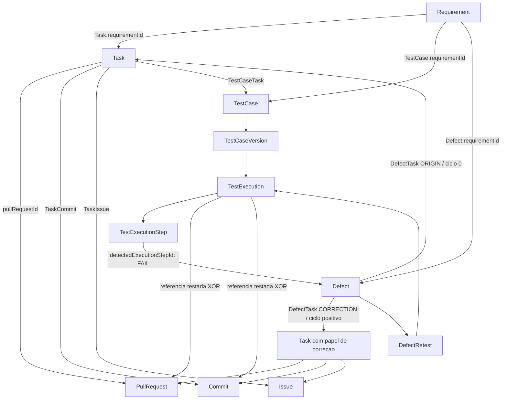

# S1-09 — Regras de rastreabilidade: baseline e decisões resolvidas

**Regra vigente — FINAL TARGETED CORRECTIONS da Etapa 5, 2026-09-12.** Esta decisão substitui a exigência anterior de confirmação terminal manual. `Requirement.status` permanece persistido, mas agora é o macro derivado da mesma policy pura que produz a situação detalhada. O estado anterior não entra no cálculo da conclusão.

## Autoridade única e mapa canônico

`projectRequirement` calcula a situação a partir da cadeia corrente; `deriveRequirementLifecycleStatus` aplica o mapa abaixo. `traceabilityMutation`/`reconcileRequirements` persistem macro, situação e transição na mesma transação da mutação original. GET permanece somente leitura.

| TraceabilitySituation | Requirement.status |
|---|---|
| SEM_RASTREABILIDADE | PLANEJADO |
| PLANEJADO | PLANEJADO |
| EM_DESENVOLVIMENTO | EM_IMPLEMENTACAO |
| IMPLEMENTADO | EM_IMPLEMENTACAO |
| AGUARDANDO_VALIDACAO | EM_VALIDACAO |
| EM_VALIDACAO | EM_VALIDACAO |
| VALIDADO (compatibilidade histórica) | EM_VALIDACAO |
| COM_FALHA | EM_CORRECAO |
| EM_CORRECAO | EM_CORRECAO |
| AGUARDANDO_RETESTE | EM_CORRECAO |
| CONCLUIDO | CONCLUIDO |

Status não é editável nem depende de aceite manual. As rotas antigas de status/confirmação rejeitam a operação com `409 REQUIREMENT_STATUS_DERIVED`, preservando autorização e validação. Nenhuma nova mutação produz APROVADO, CADASTRADO ou VALIDADO como macro. Os valores antigos permanecem reconhecíveis em registros/consumidores de compatibilidade; não são removidos destrutivamente do banco.

## Ordem vigente

1. Defect relevante ABERTO ou passo FAIL corrente sem Defect ativo que o represente → COM_FALHA.
2. Defect relevante EM_CORRECAO → EM_CORRECAO.
3. Defect relevante AGUARDANDO_RETESTE → AGUARDANDO_RETESTE.
4. Sem qualidade prioritária: zero Tasks → SEM_RASTREABILIDADE; Tasks não iniciadas e sem evidência → PLANEJADO; implementação incompleta → EM_DESENVOLVIMENTO.
5. Implementação pronta e zero casos ativos relevantes → IMPLEMENTADO.
6. Implementação pronta e algum caso sem execução da currentVersion → AGUARDANDO_VALIDACAO, inclusive PASS de outro caso ou da versão anterior.
7. Validação corrente incompleta, inclusive BLOCKED, sem condição anterior → EM_VALIDACAO.
8. Implementação pronta, casos ativos relevantes não vazios, todos PASS na versão atual e nenhum Defect pendente → CONCLUIDO automaticamente.

VALIDADO continua no vocabulário histórico e no mapa, mas a aprovação completa atual converge diretamente para CONCLUIDO. A implementação técnica continua exigindo pelo menos uma Task, todas concluídas e PR/commit ligado. Issue isolada não é evidência técnica. Artefato de correção permanece uma dimensão informativa, sem condição extra inventada para concluir.

## Conclusão reversível e histórico

| Mudança após CONCLUIDO | Situação / macro, na ausência de condição de maior prioridade |
|---|---|
| Nova Task A_FAZER ou EM_ANDAMENTO | EM_DESENVOLVIMENTO / EM_IMPLEMENTACAO |
| Novo TestCase ativo sem execução | AGUARDANDO_VALIDACAO / EM_VALIDACAO |
| Nova versão de TestCase, PASS somente antigo | AGUARDANDO_VALIDACAO / EM_VALIDACAO |
| Novo FAIL não tratado ou Defect ABERTO | COM_FALHA / EM_CORRECAO |
| Defect em correção ou aguardando reteste | EM_CORRECAO ou AGUARDANDO_RETESTE / EM_CORRECAO |
| Cadeia novamente completa | CONCLUIDO / CONCLUIDO |

A conclusão anterior permanece no histórico append-only. Novas entradas usam `rulesVersion: 3`; versões 1/2 permanecem intactas. Reparar apenas um macro legado, com situação já correta, não fabrica uma transição detalhada. Dry-run expõe `statusChanges` separadamente de `changes`; segundo apply sem mudanças não grava novos eventos. Falha na escrita do histórico desfaz a mutação, o macro e o State juntos.

Relevância por projeto, deduplicação, currentVersion, ordenação executedAt/id, cobertura por passo FAIL, lifecycle de Defect e reteste contextual permanecem canônicos. PASS comum não encerra um Defect. Progresso continua independente: 25% com Defect em correção é EM_CORRECAO com progresso de 25%.

## Filtros, adoção e evidência

O catálogo apresenta **Status** como filtro principal de cinco macros e **Situação detalhada** em “Detalhamento opcional”. O backend aplica ambos sobre a projeção completa antes da paginação. Summary e cards usam a mesma fonte; nenhuma policy de domínio no frontend.

Migration incremental `20260912010000_s109_lifecycle_effort_history`: default PLANEJADO e novo histórico de esforço. Não transforma registros antigos por heurística SQL. A adoção dos macros usa o reconciliador existente com `--policy`, dry-run antes de apply, em ambiente explicitamente conferido. No desenvolvimento local, quatro macros foram sincronizados, sem novas transições detalhadas; repetição idempotente. Nenhuma adoção de produção nesta rodada.

Especificação: [projeção e histórico](../data/REQUIREMENT_TRACEABILITY_HISTORY.md). Evidência atual e auditoria APROVADO: seção **FINAL TARGETED CORRECTIONS** do [relatório da Etapa 5](../deliveries/S1_09_TRACEABILITY_GRAPH_WORKSPACE_UX_REPORT.md). As conclusões de etapas anteriores registram suas respectivas revisões, não a regra vigente acima.

## Registro histórico da auditoria da Etapa 1

O texto abaixo é preservado integralmente como evidência da auditoria e das alternativas consideradas. **PROPOSTA, OPEN DECISIONS e “não implementado” dentro deste registro descrevem a Etapa 1; não são decisões vigentes ou bloqueios atuais.** Em particular, as seções antigas 16–19, 23 e 26 e suas tabelas devem ser lidas à luz das resoluções acima.

<details>
<summary>Auditoria e propostas originais da Etapa 1 — registro histórico</summary>

# S1-09 — Regras de rastreabilidade: baseline e proposta de ampliação

## 1. Objetivo

Auditar a rastreabilidade existente e especificar a próxima evolução sem alterar o produto. Esta etapa entrega documentação, não um novo motor, endpoint, grafo ou modelo persistente.

**Resultado: S1-09 TRACEABILITY BASELINE — OPEN DECISIONS.** O baseline foi identificado; a semântica nova está proposta de forma determinística, mas depende das quatro decisões humanas da seção 26. Nenhuma proposta abaixo substitui silenciosamente uma regra vigente.

## 2. Autoridade e baseline

| Campo | Valor observado |
|---|---|
| Data | 2026-09-10 |
| Branch | `daniel-dev` |
| HEAD | `503c7a3ea38fd56b3a7cf37d48b4fe3c120bd000` |
| Working tree inicial | Limpo; `git status --short` sem saída |
| `git diff --check` inicial | PASS |
| Método | Leitura de contratos, decisões, relatórios, schema, backend, frontend e testes; simulação das funções puras atuais |
| Limite da evidência | Sem consulta ou mutação do banco, sem HTTP/GitHub, sem homologação visual e sem nova execução das suítes de integração |

Ordem desta etapa: instrução humana atual e decisões canônicas → regras documentadas → contratos/ADRs → QA validado → implementação. A ordem histórica de [Contexto e arquitetura](../../TRACEFLOW_CONTEXTO_ARQUITETURA.md#3-fonte-de-verdade-e-precedência-documental) situa o TCC e as decisões posteriores; não autoriza promover o protótipo ou o código a uma decisão de negócio nova. Não houve consulta ao TCC original nesta etapa; o mapeamento funcional usa os documentos vigentes versionados.

Fontes de autoridade lidas:

- [ADR-006](../architecture/ADR-006-CANONICAL-DATA-MODEL.md): Task–PR singular e relações tipadas; [ADR-008](../architecture/ADR-008-LEGACY-COMPATIBILITY-CONTRACT.md): contexto histórico, explicitamente substituído na política pré-release.
- [E0 baseline](../refactoring/E0_BASELINE.md), [matriz E0](../refactoring/E0_TRACEABILITY_MATRIX.md) e [E10](../refactoring/E10_REQUIREMENTS_TRACEABILITY.md): evolução MVP, fórmulas, RF41 e perspectivas. Placeholders 501 descritos na E0 não são o estado atual.
- [API_CONTRACTS](../api/API_CONTRACTS.md), [matriz RF vigente](RF_TECHNICAL_MATRIX.md), [roadmap S1-09](../../TRACEFLOW_ROADMAP_INCREMENTAL.md#s1-09---ampliar-rastreabilidade-entre-requisitos-testes-e-defeitos).
- [TestCase history](../data/TEST_CASE_HISTORY.md), [Defect history](../data/DEFECT_HISTORY.md), [Planning history](../data/PLANNING_HISTORY.md).
- [QA S1-07](../qa/S1_07_FINAL_INTEGRATED_QA.md), [correções S1-07](../qa/S1_07_TARGETED_CORRECTIONS_RESULT.md), [fundação S1-08](../deliveries/S1_08_BACKEND_FOUNDATION_REPORT.md), [integração S1-08](../deliveries/S1_08_FRONTEND_INTEGRATION_REPORT.md). Resultados desses relatórios são históricos, não gates reexecutados neste HEAD.
- [Autorização](../security/AUTHORIZATION_MATRIX.md), [retenção](../privacy/DATA_RETENTION_POLICY.md), [Design System](../design/DESIGN_SYSTEM.md) e [inventário de UI](../design/UI_SURFACE_INVENTORY.md). O canvas legado possui compatibilidade `on-light`; isso não equivale a redesenho C2 homologado.

Convenção: **BASELINE** = comportamento verificado; **PRESERVAR** = regra vigente/instrução humana; **PROPOSTA** = especificação futura condicionada; **OPEN DECISIONS** = decisão humana necessária. Divergências são identificadas na seção 24.

## 3. Arquitetura atual

Backend real: `routes → controller → traceability.service → traceability.repository → Prisma`; `traceability.calculator` calcula e `traceability.mapper` monta DTOs. O módulo `backend/src/modules/traceability/` existe. Não há model genérico de vínculos em uso.

| Fonte de implementação | Responsabilidade auditada |
|---|---|
| [schema.prisma](../../backend/prisma/schema.prisma) | Cardinalidades, exclusão, versões, ciclos e históricos |
| [calculator](../../backend/src/modules/traceability/traceability.calculator.js) | `buildMetric`, `calculateProgress`, `getImplementationStatus`, `buildRequirementMetrics`, `buildMatrixSummary` |
| [repository](../../backend/src/modules/traceability/traceability.repository.js) | Seleções resumidas, paginação, contagens e perspectivas reversas |
| [mapper](../../backend/src/modules/traceability/traceability.mapper.js) | `formatMatrixRow`, grafos, deduplicação e minimização de artefatos |
| [service](../../backend/src/modules/traceability/traceability.service.js), [controller](../../backend/src/modules/traceability/traceability.controller.js), [routes](../../backend/src/modules/traceability/traceability.routes.js), [validation](../../backend/src/modules/traceability/traceability.validation.js) | Orquestração, contratos e validação de IDs/página |
| [requirement.schema](../../backend/src/modules/requirements/requirement.schema.js), [status service](../../backend/src/modules/requirements/services/requirement-status.service.js), [task service](../../backend/src/modules/requirements/services/requirement-task.service.js), [CRUD](../../backend/src/modules/requirements/services/requirement-crud.service.js), [repository](../../backend/src/modules/requirements/requirement.repository.js) | Status persistido, conjunto atômico de Tasks e exclusão |
| [task.repository](../../backend/src/modules/tasks/task.repository.js), [task-link.repository](../../backend/src/modules/tasks/repositories/task-link.repository.js), [task-movement.repository](../../backend/src/modules/tasks/repositories/task-movement.repository.js) | Escritas, recálculo dos requisitos afetados e reconciliação dos defeitos |
| [task-crud](../../backend/src/modules/tasks/services/task-crud.service.js), [task-requirement](../../backend/src/modules/tasks/services/task-requirement.service.js) | Criação/edição/exclusão e vínculos diretos de implementação |
| [commit-suggestion.service](../../backend/src/modules/traceability/commit-suggestion.service.js) | RF41; sugestão não é `TaskCommit` confirmado |

Leituras atuais, todas sob `/api/projects/:projectId/traceability/`:

- `requirements-matrix`: `{projectId, summary, requirements, pagination}`; página padrão 1, limite padrão 20, máximo 100.
- `requirements/:requirementId`: grafo, paginação de Tasks.
- `tasks/:taskId`: grafo, paginação de artefatos; ordem de grupos PR → commits → issues.
- `artifacts/:artifactType/:artifactId`: grafo reverso, paginação de Tasks; tipos `commit`, `pull-request`, `issue`.
- `{requirement-task,pull-request,commit,issue}-coverage`: cobertura de vínculos, distinta do progresso.
- `commit-suggestions` e operações de scan/revisão: sugestões específicas RF41; somente confirmação cria relação canônica.

Autenticação, CSRF e autorização são montados em [app.js](../../backend/src/app.js) e no [middleware project-scoped](../../backend/src/middlewares/auth/project-authorization.middleware.js). Leitura exige membership ativa VIEWER+; recurso alheio retorna 404. A consulta não chama GitHub nem escreve histórico.

### Tela existente e owners

`/projects/:projectId/traceability` em [AppRoutes](../../frontend/src/app/routes/AppRoutes.jsx) → [TraceabilityPage](../../frontend/src/pages/TraceabilityPage.jsx) → [TraceabilityScreen](../../frontend/src/features/traceability/pages/TraceabilityScreen.jsx) → [API client](../../frontend/src/features/traceability/api/traceability.api.js) → [TraceabilityFlow](../../frontend/src/features/traceability/components/TraceabilityFlow.jsx).

O Screen possui estado local e dois `useAbortableRequest`: um para matriz e outro para requisito selecionado. Não existe hook/model de situação separado. A API devolve dados sem recalcular métricas no frontend. Fluxo auditado no código: resumo → matriz → clique na linha/botão do requisito → GET do detalhe → React Flow → botão do node expande/recolhe os dados já carregados, sem request por node.

Há loading, erro fatal contextual, erro recuperável, lista vazia, ausência de seleção, erro/loading de detalhe, paginação da matriz e centralização/zoom/minimap. Não há seleção automática inicial. O grafo não possui controles para buscar a segunda página de Tasks; o Screen pede `{}` e recebe os 20 primeiros. As funções de API para Task/artefato existem, mas este Screen só usa matriz e requisito: não há seletor dessas perspectivas na tela auditada.

Resumo real, calculado no backend sobre **todos** os requisitos do projeto:

| Card | Campo/fórmula |
|---|---|
| Total de requisitos | `summary.totalRequirements = rows.length` |
| Com tarefas | `requirementsWithTasks`: linhas com `tasksCount > 0` |
| Com evidência técnica | `requirementsWithTechnicalEvidence`: linhas com `hasTechnicalEvidence` |
| Implementados | `implementedRequirements`: situação herdada `IMPLEMENTADO` OU `CONCLUIDO` |
| Progresso médio | `summary.averageProgress`; fórmula da seção 6 |

Matriz real:

| Coluna | Source / cálculo | Owner |
|---|---|---|
| Requisito | `Requirement.title`; JSX admite descrição, mas `formatMatrixRow` não a envia | Backend fornece título; frontend apresenta |
| Status | `Requirement.status`, label local | Persistido/backend; apresentação frontend |
| Progresso | `progress.percentage`, “Sem dados” para null; barra usa 0 nesse caso | Calculator; frontend só formata |
| Tarefas | `completedTasksCount/tasksCount` | Calculator |
| Issues | `issuesCount`, número de vínculos no agregado atual | Calculator/repository |
| PRs | `pullRequestsCount`, Tasks com PR, não PRs distintos | Calculator/repository |
| Commits | `commitsCount`, número de vínculos no agregado atual | Calculator/repository |
| Evidência | `hasTechnicalEvidence` → Com/Sem evidência | Calculator; badge frontend |
| Situação | `implementationStatus`, label local | Calculator; texto frontend |

## 4. Regras herdadas da rastreabilidade anterior

Preservar explicitamente:

1. Task é o elo da implementação: Requirement tem várias Tasks; cada Task tem no máximo um Requirement.
2. PR singular por Task; commits/issues por joins específicos. Nenhum `TraceLink`, `GithubArtifact`, `TaskPullRequest` ou relação genérica nova.
3. Progresso depende de Tasks atuais concluídas, não de testes, defeitos, esforço, sprint ou estado do GitHub.
4. PR OU commit confirmado fornece evidência técnica; Issue isolada é contexto. Não exigir merge retroativamente.
5. Ausência de denominador difere de 0%; média por requisito inclui requisito sem Task como zero.
6. Preservar `Requirement.status`, seu recálculo e os campos/estados derivados existentes. A nova situação deve ser aditiva, não uma troca de significado do campo `implementationStatus`.
7. Summary global independente da página; nodes/edges tipados e deduplicados; seleção e expansão continuam princípios da UI futura.
8. Sugestão de commit PENDING/REJECTED não é evidência; confirmação humana cria `TaskCommit`. A sintaxe RF41 `[TASK-<ID>]` não autoriza vínculo automático definitivo.
9. Ownership por projeto, leitura minimizada e histórico real permanecem obrigatórios. Expansão de qualidade não completa por si só todos os RFs S1-09.

## 5. Requirement.status vs traceability situation

**BASELINE:** `Requirement.status` é String persistida. Criação pelo service escreve `CADASTRADO`; default do schema é `PENDENTE`. Os valores aceitos são `CADASTRADO`, `APROVADO`, `EM_IMPLEMENTACAO`, `VALIDADO`, `CONCLUIDO`, `PENDENTE`, `EM_ANDAMENTO`, `CANCELADO`. Não é correto descrevê-lo hoje como um fluxo exclusivamente de aprovação humana da especificação.

`calculateRequirementStatus(tasks)`: zero Tasks → CADASTRADO; todas A_FAZER → APROVADO; todas CONCLUIDO → VALIDADO; demais → EM_IMPLEMENTACAO. Os recálculos preservam CONCLUIDO/CANCELADO. Criação, edição, remoção, movimento e reatribuição de Task podem recalcular os requisitos afetados; criação de correção também reutiliza essa regra.

`PATCH /requirements/:id/status` aceita os estados permitidos, sem uma máquina de transições restrita no service. `confirm-completion` exige apenas status persistido VALIDADO; não exige teste PASS, reteste, PR ou commit. Logo **VALIDADO persistido não comprova validação por TestExecution**.

Há separação de armazenamento, mas não independência completa: `getImplementationStatus` consulta `Requirement.status === CONCLUIDO` antes de qualquer outra condição. Esse acoplamento é baseline testado e não deve ser removido silenciosamente.

**PROPOSTA:** acrescentar `traceabilitySituation` derivada do consolidado de implementação/qualidade, sem escrever `Requirement.status` e sem reutilizar seu CONCLUIDO como atalho. Manter `implementationStatus` como projeção herdada. `status=APROVADO` e `traceabilitySituation=COM_FALHA/EM_CORRECAO` são compatíveis. Também pode existir `status=CONCLUIDO` com situação ampliada COM_FALHA; o DTO deve explicar as dimensões, não esconder a falha. Mudar o lifecycle persistido para “somente aprovação da especificação” seria outra decisão, fora desta etapa.

## 6. Progresso

Fonte: `calculateProgress` e `buildMetric` do calculator. Para o conjunto atual `T(R) = Tasks existentes com requirementId=R.id`:

```text
n = count(T.status === 'CONCLUIDO')
d = T.length
hasData = d > 0
percentage = hasData ? Number(((n / d) * 100).toFixed(2)) : null
progress = { numerator: n, denominator: d, percentage, hasData }
progressPercentage legado = percentage ?? 0
```

Os nomes TODO/IN_PROGRESS/DONE do pedido correspondem a A_FAZER/EM_ANDAMENTO/CONCLUIDO, não a enums novos.

| Caso | n/d | Percentual estruturado | Observação |
|---|---|---|---|
| Zero Tasks | 0/0 | null; hasData=false | UI “Sem dados”; escalar legado 0 |
| Uma A_FAZER | 0/1 | 0 | Planejada sem evidência |
| Uma EM_ANDAMENTO | 0/1 | 0 | Não há crédito parcial |
| Uma CONCLUIDO | 1/1 | 100 | Ainda pode faltar evidência técnica |
| Quatro, uma concluída | 1/4 | 25 | |
| Quatro, três concluídas | 3/4 | 75 | |
| Todas concluídas | d/d, d>0 | 100 | Qualidade não é avaliada aqui |
| Task desvinculada/reatribuída | Sai de T(R) | Recalcula o conjunto atual | Novo Requirement recebe a Task uma vez |
| Task excluída fisicamente | Sai de T(R) | Numerador/denominador podem mudar | Não existe `Task.deletedAt` |
| Task de Sprint encerrada | Usa Task atual se ainda ligada a R | Status atual | Não lê `SprintTask.exitStatus` ou snapshot |
| Snapshot de Task já excluída | Não entra em T(R) | Nenhum peso | Continua apenas no histórico Planning |

Task ligada a Defect, inclusive tombstone, não pode ser apagada (`TASK_REFERENCED_BY_DEFECT`). Para as demais, o DELETE remove joins e a Task, preservando a participação histórica de Sprint por snapshot/SetNull. TestCaseTask atual pode desaparecer por cascade; versões anteriores ficam intactas.

**Correction Task já é Task comum.** Se seu `requirementId=R`, entra no progresso, inclusive correções de ciclos antigos ainda vinculadas. Uma Task compartilhada conta uma vez por identidade. Criar uma correção A_FAZER após 1/1 DONE pode reduzir progresso de 100% para 50%; isso é trabalho adicional, não influência direta de Defect. Não incluir Tasks apenas por serem ORIGIN/CORRECTION de um Defect de R se seu próprio requirementId não for R; não excluir correções do denominador para manter uma curva artificialmente crescente.

Média global histórica: para N requisitos, somar os percentuais individuais já arredondados (null vira 0) e dividir por N, arredondando a duas casas. N=0 → percentage=null/hasData=false, escalar legado 0. `averageProgress.numerator` é soma de percentuais; não quantidade de Tasks. Não pondera por esforço nem por quantidade de Tasks. Exemplo: R1=100%, R2 sem Tasks → média 50%.

**Limitação observada:** matriz agrega todas as Tasks; `formatRequirementGraph` recebe somente a página de Tasks e calcula as métricas sobre ela. Simulação pura reproduziu matriz 20/21=95,24%, contra grafo 20/20=100% e IMPLEMENTADO, embora `summary.tasksCount=21`. Não copiar esse recorte para o motor futuro; correção fica fora desta auditoria.

## 7. Evidência técnica

Fonte: `buildRequirementMetrics`. `hasTechnicalEvidence = pullRequestsCount > 0 || commitsCount > 0`. Basta uma Task de R com `pullRequestId`/PR ou pelo menos um `TaskCommit`. Não exige evidência por Task, PR closed/merged, branch específica, data posterior ao trabalho ou conteúdo da mensagem. Um commit basta. Issue não participa desse booleano, mas aparece no grafo e na cobertura de issues. Referência testada de execução, por si só, não cria `TaskCommit` nem satisfaz essa regra.

Cardinalidades reais:

| Relação | Cardinalidade / persistência |
|---|---|
| Requirement → Task | 0..N; inversa Task → Requirement 0..1 por `requirementId` |
| Task → PullRequest | 0..1; PR → Tasks 0..N por `pullRequestId` |
| Task ↔ Commit | N:N por `TaskCommit`, unique(taskId,commitId) |
| Task ↔ Issue | N:N por `TaskIssue`, unique(taskId,issueId) |

Contadores legados de PR/commit/issue contam **relações**, podendo repetir o mesmo artefato ligado a Tasks diferentes. A lista extraída e os nodes são únicos por ID, mas `Math.max(unique.length, linkedCount)` preserva a contagem de vínculos. Exemplo reproduzido: duas Tasks com o mesmo commit → commitsCount=2 e um node COMMIT. Distinguir futuros `artifactDistinctCount` de `linkCount`; não mudar o valor legado sem contrato explícito.

## 8. Implementado

Não há booleano persistido `implemented`. Em consulta, salvo o override de status CONCLUIDO, IMPLEMENTADO requer **pelo menos uma Task, todas CONCLUIDO e evidência técnica presente**. `Requirement.status` APROVADO/VALIDADO não é necessário; apenas CONCLUIDO tem precedência especial. PR aberto vale; commit vale; Issue sozinha não vale. Todas DONE sem PR/commit resulta EM_DESENVOLVIMENTO, mesmo com progresso 100%.

Para a ampliação, definir `implementationReady = T.length>0 && done===total && hasTechnicalEvidence`, independentemente de status persistido. Manter o significado herdado e expor separadamente `legacyImplementationStatus`. TestCase PASS não torna a implementação pronta.

## 9. Situações atuais

Ordem exata do calculator; a primeira condição satisfeita vence:

| Prioridade | Estado | Condição | Label na matriz | Badge/cor da situação |
|---|---|---|---|---|
| 1 | CONCLUIDO | Requirement.status=CONCLUIDO | Concluído | Texto, sem badge próprio |
| 2 | SEM_RASTREABILIDADE | Zero Tasks | Sem rastreabilidade | Texto |
| 3 | IMPLEMENTADO | Todas Tasks DONE e evidência | Implementado | Texto |
| 4 | EM_DESENVOLVIMENTO | Alguma DONE OU EM_ANDAMENTO OU evidência | Em desenvolvimento | Texto |
| 5 | PLANEJADO | Demais casos com Tasks | Planejado | Texto |

São constantes em função e mapas de apresentação, não enum Prisma. A coluna Evidência, sim, usa `status-ativo` (tokens success) ou `status-pendente` (tokens neutral) em [global.css](../../frontend/src/styles/global.css). As cores dos nodes representam **tipo de entidade**, não situação: requisito azul, Task amarelo, PR roxo, commit azul-claro, issue verde. O detalhe do node Requirement exibe `implementationStatus` cru, ao contrário do label traduzido da matriz.

## 10. Novos artefatos S1-07/S1-08

| Artefato | Baseline e fonte |
|---|---|
| TestCase | Project obrigatório, responsável ativo, status ATIVO/INATIVO, Requirement 0..1 e Tasks 0..100 por TestCaseTask. [Service](../../backend/src/modules/testCases/services/test-case.service.js) valida Requirement OU Task na criação/estado resultante do PUT |
| TestCaseVersion | Unique(testCaseId,version), snapshot da definição e vínculos, currentVersion crescente. Alterar definição/vínculos cria versão; status/responsável/no-op não. [Schema](../../backend/src/modules/testCases/test-case.schema.js) |
| TestExecution | Ocorrência persistida com FK da versão, número da versão, executor/data do servidor, ambiente e exatamente uma referência PR OU Commit importada do projeto. [Execution service](../../backend/src/modules/testCases/services/test-execution.service.js) |
| TestExecutionStep | Todas as posições da versão, uma vez cada; texto/expectativa congelados; PASS/FAIL/BLOCKED. FAIL/BLOCKED requer observação. Agregação FAIL > BLOCKED > PASS |
| TestEvidence | Metadados/bytes privados de execução ou passo; zero arquivos é válido. Download autenticado; não é requisito de aprovação adicional |
| Defect | Project, responsável, severidade BAIXA/MEDIA/ALTA/CRITICA; detectedExecutionStepId obrigatório, imutável, FAIL do projeto; Requirement OU ORIGIN Task obrigatório. [Service](../../backend/src/modules/defects/defect.service.js) |
| Correction Task | Task normal, ligada por DefectTask relationType=CORRECTION e ciclo positivo; não há model/subtipo Task separado |
| Correction Cycle | Número em Defect.currentCorrectionCycle/DefectTask/DefectRetest; **não existe tabela CorrectionCycle** |
| Retest | DefectRetest → TestExecution, única por testExecutionId; não há duplicação da execução/resultados nem status próprio |

Soft delete de TestCase oculta definição atual/histórico pelo caso, mas execução por ID e evidências continuam acessíveis. Exclusão física de Requirement/Task pode tornar um TestCase legado sem vínculo atual; a invariante é aplicada na escrita explícita, não por backfill ou CHECK entre tabelas. A próxima edição deve satisfazê-la. Defect.requirement usa RESTRICT, inclusive para Defect excluído; não presumir que todo Requirement pode ser apagado.

As projeções de Defect consultadas foram [repository](../../backend/src/modules/defects/repositories/defect.repository.js), [projection repository](../../backend/src/modules/defects/repositories/defect-projection.repository.js), [presenter](../../backend/src/modules/defects/defect.presenter.js), [schema](../../backend/src/modules/defects/defect.schema.js) e [retest service](../../backend/src/modules/defects/defect-retest.service.js):

| Estado/resultado | Regra vigente |
|---|---|
| ABERTO | Nenhuma CORRECTION no ciclo atual OU todas A_FAZER |
| EM_CORRECAO | Mistura que não seja todas TODO/todas DONE; inclui todas EM_ANDAMENTO |
| AGUARDANDO_RETESTE | Ao menos uma CORRECTION no ciclo, todas DONE |
| VALIDADO | Reteste contextual PASS no ciclo atual |
| Reteste FAIL | ABERTO, próximo ciclo vazio; não reabre Tasks antigas |
| Reteste BLOCKED | Mesmo ciclo, AGUARDANDO_RETESTE |

ORIGIN usa ciclo 0 e não determina status de correção. Uma Task não pode ser ORIGIN e CORRECTION do mesmo Defect, em nenhum ciclo. Pode corrigir vários Defects e ser relincada explicitamente em novo ciclo. Reteste exige mesmo TestCase da detecção, ativo, versão atual, revisão/ciclo válidos e correções DONE. Execução comum PASS nunca valida Defect. O PASS contextual mantém Defect VALIDADO mesmo se Task compartilhada voltar de coluna; uma falha posterior comum também não reabre o Defect automaticamente. Preservar essas decisões.

## 11. Cadeia canônica ampliada



O desenho separa papéis para leitura; CT e T são a mesma entidade Task e precisam do mesmo node quando seus IDs coincidirem. Defect → TestCase deriva de detectedStep → execution → testCaseId; não existe Defect.testCaseId direto. Um TestCase pode alcançar vários Requirements pelas Tasks apesar do Requirement direto singular. Sem criação de relações persistentes além das existentes.

## 12. TestCases relevantes

**BASELINE:** o catálogo aceita filtro direto requirementId e filtro taskId; não oferece a união transitiva por Requirement. `latestExecution` em [repository](../../backend/src/modules/testCases/repositories/test-case.repository.js) é a última de **qualquer versão**, por `(executedAt DESC,id DESC)`, sem filtro de ambiente/referência. [Presenter](../../backend/src/modules/testCases/test-case.presenter.js) preserva o número da versão. Nunca executado significa ausência de qualquer execução. Um PASS da v1 continua sendo latestExecution após criar v2 sem execução.

**PROPOSTA P-TC, condicionada à OD-02:**

1. Conjunto relacionado: TestCases não excluídos do mesmo projeto em que `requirementId=R` **OU** exista TestCaseTask cuja Task atual tenha requirementId=R. União por `TestCase.id`, não por caminho. Não propagar por artefato compartilhado, Defect ou snapshot antigo.
2. Conjunto relevante à decisão Q(R): relacionados com status ATIVO. Inativos aparecem em contador separado, sem crédito PASS nem bloqueio de validação. Tombstones só integram navegação histórica autorizada, não o agregado operacional.
3. Resultado atual proposto: última execução persistida do mesmo TestCase e **currentVersion**, ordem `(executedAt,id)` descendente. Referência e ambiente devem ser expostos; a proposta mínima não filtra ambiente, não exige merge nem inventa release/alvo de validação inexistente.
4. Se não existe execução dessa versão: projeção `NUNCA_EXECUTADO` **da versão atual**, `pendingReason=NEVER_EXECUTED` se nunca houve execução, ou `CURRENT_VERSION_NOT_EXECUTED` se só existe histórico. Não renomear o `latestExecution`/filtro NEVER_EXECUTED S1-07; acrescentar campo novo.
5. PASS/FAIL/BLOCKED são resultados da execução, não do TestCase. Resultado de versão antiga permanece intacto no histórico. Uma execução não é parcialmente persistida; “em validação” será estado do conjunto, não uma sessão de teste em andamento no banco.

Reatribuir uma Task pode alterar quais Requirements alcançam o caso sem mudar currentVersion. A proposta usa relações **atuais** para a situação atual; não afirma que o Requirement novo foi validado na data da execução antiga. O snapshot da versão contém id/title da Task, não seu requirementId histórico; não há base para reconstruir essa pertinência passada. Validade de um PASS após reatribuição/código novo é parte da OD-02, e não uma garantia do contrato atual.

## 13. Defects relevantes

**PROPOSTA P-DEF:** D(R) é a união por `Defect.id` dos Defects não excluídos, do mesmo projeto, com `Defect.requirementId=R` OU alguma relação **ORIGIN** cuja Task atual tenha requirementId=R. Defect pode alcançar mais de um Requirement; cada agregado conta uma vez.

Não usar CORRECTION para inferir que o defeito pertence a outro Requirement: trabalho de correção compartilhado é contexto de correção, não nova origem. Não inferir pertinência do TestCase de detecção quando os vínculos próprios do Defect apontam a outro lugar. Esses caminhos podem ser exibidos no grafo com seus papéis explícitos.

Um Defect relevante continua pendente mesmo se seu TestCase for inativado, excluído ou relincado; D(R) não é filtrado por Q(R). Soft delete remove a pendência operacional, mas não é validação/retorno PASS. ABERTO, EM_CORRECAO e AGUARDANDO_RETESTE são pendentes; somente VALIDADO não bloqueia. Severidade permanece informação e ordenação, sem mudar a fórmula do progresso ou a precedência proposta.

## 14. Evidência de implementação

Preservar `hasTechnicalEvidence` exatamente. Dimensão proposta: `{present, taskCount, linkCounts, distinctArtifactCounts}` com `present` equivalente ao booleano antigo. Separar `implementationReady` de presença de artefato: commit numa Task TODO dá evidência, não implementação pronta. Um artefato referido somente em TestExecution não é inserido nessa dimensão.

## 15. Evidência de validação

Proposta: `{applicable, relevantCount, executedCurrentVersionCount, pass, fail, blocked, pending, validated}`. `applicable = Q.length>0`; `executed = pass+fail+blocked`; `pending = relevantCount-executed`. `validated = Q.length>0 && pass===Q.length && nenhum Defect relevante pendente`. Não há aprovação vacuamente verdadeira de um conjunto vazio.

“Validação terminou” como **cobertura de execução**: Q não vazio e pending=0. Isso não significa sucesso: FAIL/BLOCKED podem estar presentes. “Validação aprovada”: todos PASS na projeção escolhida e nenhuma pendência de Defect. Não há RUNNING/DRAFT de TestExecution no banco. BLOCKED é execução registrada, mas validação não aprovada; PASS parcial + nunca executado também não aprova.

Uma execução PASS traz referência testada obrigatória, mas não prova que foi testado o último commit da implementação ou cada PR/Task. Essa garantia exige política de contexto de validação, não disponível hoje (OD-02). Upload de evidência não é obrigatório e arquivo algum substitui resultado persistido.

## 16. Evidência de correção

Dimensão independente: quando D(R) é vazio, `applicable=false` e resultado “Não aplicável”, não um PASS inventado. Para cada Defect relevante, expor ciclo atual, Tasks de correção, artefatos vinculados e retestes explícitos com execução/versão/referência.

**Proposta mínima (OD-03):** correção completa exige Defect VALIDADO, reteste contextual PASS do ciclo atual e pelo menos um PR/commit vinculado às CORRECTION Tasks desse ciclo. Não exige um artefato por Task, nem todos os ciclos antigos PASS; ciclos antigos com FAIL fazem parte da história. Ausência de artefato é lacuna de evidência, não reabertura automática de Defect validado. A dimensão pode mudar com vínculos atuais sem reescrever o reteste histórico.

O contrato S1-08 permite retestar com referência importada do projeto que não pertença à correção. Portanto, expor separadamente `testedReferenceMatchesCorrectionArtifact`; não fingir que o fallback comprova correspondência. Tornar essa correspondência obrigatória para CONCLUIDO é opção explícita da OD-03. PASS comum não serve como DefectRetest, mesmo que use o mesmo commit.

## 17. Nova lista de situações — PROPOSTA

As condições abaixo são avaliadas pela precedência da seção 19, não isoladamente. P-TC/P-DEF e decisões OD-01 a OD-04 são pressupostos; a lista ainda não é enum de produção.

| Situation | Significado | Trigger/condition proposto |
|---|---|---|
| SEM_RASTREABILIDADE | Sem cadeia de trabalho de implementação disponível | Zero Tasks, sem execução relevante nem risco com maior precedência; pode haver TC ainda não executado, explicitado nos contadores |
| EM_DESENVOLVIMENTO | Trabalho incompleto ou comprovação técnica faltante | Tasks não todas DONE, ou todas DONE sem evidência e sem situação de qualidade prioritária |
| IMPLEMENTADO | Implementação técnica pronta; validação não estabelecida | implementationReady e zero TestCases relevantes; não é conclusão funcional |
| AGUARDANDO_VALIDACAO | Implementação pronta com testes definidos sem execução válida | implementationReady, Q não vazio, nenhuma execução atual válida |
| EM_VALIDACAO | Conjunto de validação iniciado sem aprovação integral | Alguma execução atual e conjunto não aprovado, inclusive BLOCKED/pendências, sem risco prioritário |
| COM_FALHA | Falha corrente não tratada ou Defect aberto | Qualquer Defect ABERTO ou FAIL atual não absorvido; sem correção/reteste de maior prioridade |
| EM_CORRECAO | Correção operacional em andamento | Algum Defect relevante EM_CORRECAO |
| AGUARDANDO_RETESTE | Correções prontas aguardando confirmação | Algum Defect relevante AGUARDANDO_RETESTE e nenhum EM_CORRECAO |
| VALIDADO | Validação aprovada, mas cadeia integral ainda incompleta | Todos Q PASS, nenhum Defect pendente; falta implementationReady ou evidência de correção; trabalho parcial com Tasks tem prioridade de desenvolvimento |
| CONCLUIDO | Cadeia completa comprovada segundo a política escolhida | implementationReady + Q não vazio/todos PASS + nenhum Defect pendente + correção completa quando aplicável |

**PLANEJADO existe no baseline e não está nos dez candidatos.** Recomenda-se preservá-lo como 11º estado para Tasks todas A_FAZER, sem evidência técnica, sem execução relevante e sem Defect relevante, mantendo a distinção “não iniciado”. Sua remoção/fusão exige OD-01. `legacyImplementationStatus` continua expondo PLANEJADO em qualquer alternativa.

## 18. Decision table — PROPOSTA

“Completa” nesta tabela significa todas Tasks DONE, com ao menos uma Task; evidência é explicitada porque 100% não a garante. Ausência de Defect é diferente de Defect validado.

| Implementação | Testes relevantes | Defeitos relevantes | Resultado proposto | Justificativa |
|---|---|---|---|---|
| Nenhuma | Nenhum | Nenhum | SEM_RASTREABILIDADE | Sem implementação/qualidade observável |
| Parcial, iniciada | Nenhum | Nenhum | EM_DESENVOLVIMENTO | Trabalho não concluído |
| Só TODO, sem evidência | Nenhum | Nenhum | PLANEJADO (OD-01) | Preservação do estado herdado |
| Completa + evidência | Nenhum | Nenhum | IMPLEMENTADO | Ausência de testes não aprova qualidade |
| Completa sem evidência | Nenhum | Nenhum | EM_DESENVOLVIMENTO | Falta regra técnica herdada |
| Completa + evidência | Todos pendentes | Nenhum | AGUARDANDO_VALIDACAO | Conjunto definido ainda não iniciado |
| Completa + evidência | PASS parcial + nunca executado | Nenhum | EM_VALIDACAO | Não aprovar por maioria |
| Completa | FAIL | Nenhum | COM_FALHA | FAIL não precisa de Defect para aparecer |
| Completa | FAIL | ABERTO | COM_FALHA | Correção não iniciada, mesmo se há Tasks TODO |
| Completa ou parcial | Qualquer | EM_CORRECAO | EM_CORRECAO | Pendência de correção prioritária |
| Completa ou parcial | Qualquer | AGUARDANDO_RETESTE, sem EM_CORRECAO | AGUARDANDO_RETESTE | Ação seguinte é confirmar correção |
| Completa sem evidência | Todos PASS | Todos VALIDADO | VALIDADO | Qualidade aprovada; falta evidência de implementação |
| Completa + evidência | Todos PASS | Todos VALIDADO; evidência de correção faltante | VALIDADO | Não fingir correção tecnicamente comprovada |
| Completa + evidência | Todos PASS | Nenhum pendente; correções completas/N/A | CONCLUIDO | Cadeia integral satisfeita |
| Nenhuma | Todos PASS, Q não vazio | Nenhum | VALIDADO | Resultado funcional existe; progresso continua Sem dados |

## 19. Precedência — PROPOSTA P-SIT

Avaliar conjunto consolidado do Requirement em uma mesma visão consistente. Não escolher o “último evento”. Primeiro predicado verdadeiro vence:

1. Existe D EM_CORRECAO → EM_CORRECAO.
2. Existe D AGUARDANDO_RETESTE → AGUARDANDO_RETESTE.
3. Existe D ABERTO ou FAIL relevante não absorvido → COM_FALHA.
4. Existem Tasks e alguma não DONE → PLANEJADO se satisfeita a exceção preservada da seção 17; caso contrário EM_DESENVOLVIMENTO.
5. Validação aprovada: se implementationReady e correção completa/N/A → CONCLUIDO; senão VALIDADO.
6. Existe execução corrente relevante, mas validação não aprovada → EM_VALIDACAO.
7. implementationReady e Q não vazio → AGUARDANDO_VALIDACAO.
8. implementationReady → IMPLEMENTADO.
9. Existem Tasks → EM_DESENVOLVIMENTO (todas DONE, falta evidência).
10. Caso restante → SEM_RASTREABILIDADE, com eventual Q pendente explicado, não omitido.

Definição proposta de **FAIL não absorvido**: há passo FAIL na execução corrente selecionada sem Defect relevante, não excluído, naquele mesmo `detectedExecutionStepId` em EM_CORRECAO/AGUARDANDO_RETESTE. Defect ABERTO não absorve a falha. Um Defect em outro passo/TestCase, ou a simples existência de Correction Task, não absorve esse FAIL. Falhas antigas superadas pela projeção de execução não são falhas atuais; Defects pendentes continuam existindo independentemente disso. Vários passos falhos são avaliados individualmente; tratar um não apaga os demais.

Mesmo quando a prioridade de correção vence uma falha distinta, manter `activeReasons`, contadores e IDs das pendências: a situação principal não deve ocultar a outra falha. Ordem fixa de apresentação de motivos e desempate por ID; severidade não altera a prioridade. A opção “qualquer falha não tratada deve vencer correção em andamento” é alternativa de OD-04, não fato derivado do código existente.

Status persistido APROVADO, CANCELADO ou CONCLUIDO não é condição desta nova função. Cancelamento continua visível como status; não exclui silenciosamente o Requirement do summary e não elimina seus riscos.

## 20. Histórico de situação

**BASELINE:** não existe RequirementHistory/TraceabilityHistory/SituationHistory/ProgressHistory no schema/runtime auditado. `AuditEvent`, `TaskHistoryEntry`, `TestCaseHistoryEntry`, `DefectHistoryEntry`, versões, execuções e snapshots Planning têm propósitos distintos.

`AuditEvent` não é suficiente sem mudança: seu minimizador em [audit.service](../../backend/src/modules/audit/audit.service.js) não aceita fromSituation/toSituation/requirementId; tem retenção técnica configurada (365 dias por padrão), expurgo por [privacy-retention](../../backend/src/shared/maintenance/privacy-retention.js) e acesso de projeto OWNER. Nem toda mutação legada produz um evento funcional completo; DELETE de Task remove seu próprio histórico. Não reconstruir transições de Requirement a partir dessas trilhas ou do estado atual.

**PROPOSTA de persistência mínima futura:** histórico funcional específico `RequirementTraceabilityHistoryEntry` (nome candidato, não model criado), não tabela genérica de links. Reutilizar padrão de histórico de Defect, convenções de autoria/contexto e transação; manter AuditEvent como trilha transversal minimizada.

| Campo conceitual | Finalidade |
|---|---|
| id, projectId, requirementId | Identidade/escopo; referenciar recurso atual quando disponível |
| requirementIdSnapshot | Identificador estável para sobreviver ao DELETE físico permitido; FK atual nullable/SET NULL é proposta, não mudança de lifecycle |
| fromSituation, toSituation | Transição real; from null somente na observação inicial |
| reason | Motivo semântico do evento; separado dos motivos consolidados da projeção |
| relatedEntityType?, relatedEntityId? | Causa primária; metadata mínima para operações com múltiplas entidades |
| occurredAt, actorUserId?, requestId? | Tempo do servidor/autoria, com política de anonimização; nunca fornecidos livremente pelo frontend |
| rulesVersion, sequence, eventKey | Regra usada, ordem por Requirement e deduplicação transacional |
| snapshotVersion, snapshotJson | Situação, progresso, contadores, razões e IDs considerados **naquele instante**; sem copiar descrições, bytes ou PII desnecessária |

A necessidade de mudança de banco na próxima fase é **SIM**, para histórico funcional confiável; as relações de qualidade já existem. Uma tabela de projeção corrente/materializada adicional só se justifica por custo medido/consistência, não é requisito automático desta auditoria.

Estratégia de captura proposta:

1. Na ativação, registrar `BASELINE_OBSERVED` no instante observado, sem atribuir data antiga ou inventar fromSituation. Histórico anterior: indisponível, não vazio fabricado nem sequência inferida.
2. Mutação canônica, cálculo consistente e evento na mesma transação; se a situação não mudou, não criar falsa transição. O histórico de domínio original registra a ação sem transição. Snapshot de progresso é do instante da transição, não promete série contínua de progresso.
3. Serializar pelo Project/Requirement em ordem estável e conferir todos os Requirements afetados, anteriores e novos. Escritas Requirement/Task/link legadas não usam todas o lock de Project; integrar apenas a movimentação de Task seria insuficiente. Não usar um GET para gravar transição atrasada.
4. Reutilizar a ordem Project → Sprint/Task/Defect/TestCase já estabelecida nos respectivos fluxos; desenho transacional deve evitar inversão. Leitura global e da página devem representar o mesmo consolidado.
5. Eventos persistidos não mudam quando links, versões, status, nomes ou regras mudam depois. Novas regras geram nova observação `RULES_VERSION_CHANGED`, sem recalcular eventos antigos. Anonimização é a exceção canônica de identidade, não autorização para mudar resultados.

Triggers/reasons candidatos: `TASK_CREATED`, `TASK_LINKED`, `TASK_UNLINKED`, `TASK_REASSIGNED`, `TASK_STATUS_CHANGED`, `TASK_DELETED`, `TECHNICAL_EVIDENCE_CHANGED`, `TEST_CASE_CREATED`, `TEST_CASE_VERSION_CHANGED`, `TEST_CASE_STATUS_CHANGED`, `TEST_CASE_TRACEABILITY_CHANGED`, `TEST_CASE_DELETED`, `TEST_EXECUTED`, `DEFECT_CREATED`, `DEFECT_TRACEABILITY_CHANGED`, `DEFECT_DELETED`, `DEFECT_CORRECTION_STARTED`, `DEFECT_WAITING_RETEST`, `DEFECT_VALIDATED`, `DEFECT_CYCLE_REOPENED`, `RETEST_BLOCKED`, `REQUIREMENT_DELETED`, `BASELINE_OBSERVED`, `RULES_VERSION_CHANGED`. `TRACEABILITY_COMPLETED` pode explicar a chegada a CONCLUIDO, mas deve preservar também a causa original (por exemplo TEST_EXECUTED).

Política funcional proposta: retenção pelo ciclo do projeto, sem herdar automaticamente o expurgo técnico de AuditEvent; decidir implementação de FK/tombstone sem bloquear silenciosamente o DELETE atual. Snapshots existentes Planning não contêm a cadeia completa S1-08; não anexar Defect atual a Task congelada.

## 21. Read model necessário

**PROPOSTA**, sem endpoint implementado. Evoluir o módulo traceability existente e seu repository de leitura, mantendo contracts legados. Uma matriz/página deve trazer os agregados necessários, sem pedir N detalhes por Requirement. Detalhe/arestas/histórico podem ser carregados sob demanda para a seleção, com paginação própria.

| Bloco futuro do Requirement | Dados / origem |
|---|---|
| identity | id, displayId REQ-id, title, projectId |
| requirementStatus | Status persistido inalterado |
| implementation | progress estruturado, total/done Tasks, implementationReady, implementationStatus legado |
| technicalArtifacts | linkCounts legados; distinctCounts novos para PR/commit/issue; evidência técnica |
| tests | related/active/inactive counts, relevantCount, executedCurrentVersionCount, PASS/FAIL/BLOCKED/pending, pending por motivo; versões/IDs de execução no detalhe |
| defects | total distinct, ABERTO/EM_CORRECAO/AGUARDANDO_RETESTE/VALIDADO; IDs/razões e ciclos no detalhe |
| evidence | implementation, validation, correction; applicable separado de complete/present |
| situation | value, rulesVersion, primaryReason, activeReasons, evaluatedAt e revisão/sequence coerente com histórico |
| history | availableSince, latestTransition e cursor/limite; ausência anterior declarada |
| graph | nodes/edges canônicos, papel/ciclo/origem do vínculo, isHistorical e cobertura da página |

Performance observada por leitura do código: não há loop de requests por Requirement no Screen, nem loop de queries por Requirement no repository da matriz. Porém o summary carrega todas as Tasks resumidas de todos os Requirements em memória, e a página volta a carregar seu subconjunto; custo de dados cresce com o projeto. Prisma pode gerar queries de relação adicionais; não foi medido plano SQL/latência e não se afirma “uma única query”. O grafo de Requirement limita a página a 100 Tasks e cada coleção commit/issue a 100 por Task. Esses cortes não podem servir de universo do motor de situação.

Estratégia recomendada: consultas agregadas/batch por projectId e conjuntos de IDs, subconsulta ou window function para a última execução elegível, `COUNT DISTINCT` para casos/defeitos e agrupamento de relações/ciclos. Não chamar `test-cases?requirementId=R` repetidamente: esse filtro atual nem inclui o caminho indireto. Agregar sobre o conjunto completo; paginar somente a apresentação. Preservar summary de projeto separado de eventual summary filtrado; nunca inferir conclusão a partir de uma página.

`TaskQuality` hoje faz três streams paginados por Task selecionada (TestCases, ORIGIN Defects, CORRECTION Defects), conforme [componente](../../frontend/src/features/tasks/components/TaskQuality.jsx). Isso é contexto de detalhe existente, não um agregado de Requirement a ser replicado por card. [TestCaseDetails](../../frontend/src/features/testCases/components/TestCaseDetails.jsx) separa definição atual de execução histórica; [DefectFlow](../../frontend/src/features/defects/components/DefectFlow.jsx) reutiliza wizard/execução/retorno de reteste. Reutilizar essas fronteiras futuras de navegação.

## 22. React Flow — nodes/edges previstos

Preservar seleção de Requirement, posicionamento frontend, nodes/edges fornecidos pelo backend e clique para expandir. Não criar componentes nesta etapa. Mesmo objeto aparece uma vez; expansão de metadados ou histórico não cria nova identidade operacional.

| Tipo/papel visual | Identidade proposta | Observação |
|---|---|---|
| Requirement | `requirement:<id>` | Status, situação e progresso separados |
| Task / Correction Task | `task:<id>` | Mesmo node; papéis por relações e ciclos, sem duplicação correction-task:id |
| PullRequest | `pull-request:<id>` | Preserva identidade vigente |
| Commit | `commit:<id>` | Preserva identidade vigente |
| Issue | `issue:<id>` | Contexto, não prova técnica |
| TestCase | `test-case:<id>` | Current; versões acessíveis como contexto identificado |
| TestCaseVersion, se expandida | `test-case-version:<id>` | Nunca mesclar snapshot histórico com definição atual |
| TestExecution | `test-execution:<id>` | Uma execução, inclusive quando é reteste |
| TestExecutionStep | `test-execution-step:<id>` | Necessário para DETECTOU; não ligar falha apenas à execução geral |
| Defect | `defect:<id>` | Status/ciclo corrente e detecção histórica separados |
| Retest | `defect-retest:<id>` | Node da relação concreta, sem duplicar TestExecution; alternativa de aresta com metadata mantém os mesmos IDs |

| Relação real | Label semântico futuro | Metadados |
|---|---|---|
| Requirement → Task | IMPLEMENTA | Task.requirementId; orientação preservada do pedido |
| Requirement → TestCase | VERIFICADO_POR | Direta ou caminho derivado via Task, com path/IDs explícitos |
| Task → TestCase | VERIFICADO_POR | TestCaseTask |
| Task → PR/Commit | IMPLEMENTADO_EM | Relação confirmada; não implica merge |
| Task → Issue | RELACIONADO_A | TaskIssue |
| TestCase → Version | VERSIONADO_EM | Número/snapshotVersion |
| TestCase/Version → TestExecution | EXECUTADO_EM | FK/versão |
| TestExecution → PR/Commit | TESTOU_REFERENCIA | XOR; referência histórica, não vínculo de implementação |
| TestExecution → Step | CONTEM_PASSO | Posição/resultado |
| Step → Defect | DETECTOU | detectedExecutionStepId FAIL |
| Requirement → Defect | AFETADO_POR | Direta ou via ORIGIN, distinguindo proveniência |
| Defect → Origin Task | ORIGINADO_EM | ORIGIN, ciclo 0 |
| Defect → Correction Task | CORRIGIDO_POR | CORRECTION, ciclo positivo |
| Defect → Retest | RETESTADO_POR; VALIDADO_POR só no PASS | Resultado não pode ser rotulado validado quando FAIL/BLOCKED |
| Retest → TestExecution | REGISTRADO_EM | DefectRetest.testExecutionId |

Preservar edge IDs/tipos antigos; labels novos pertencem ao read model. Para novas relações, identidade da aresta inclui tipo, source, target e ciclo/ID do join quando necessário. Deduplicar mesmo caminho, preservando duas relações semanticamente diferentes e ciclos distintos. Uma união de pertinência para contagem não cria relação persistida Requirement–TestCase/Defect.

## 23. Cenários de exemplo — simulação semântica da proposta

Os resultados são condicionais às recomendações OD-01 a OD-04. Não foram executados contra um motor novo. Quando o enunciado omite informação decisiva, as alternativas são explícitas.

| ID | Cenário obrigatório | Resultado proposto / motivo |
|---|---|---|
| S01 | REQ, zero Tasks/Tests/Defects | SEM_RASTREABILIDADE; progresso null |
| S02 | Duas Tasks: DONE + IN_PROGRESS | EM_DESENVOLVIMENTO; progresso 50% |
| S03 | Todas DONE, evidência, zero testes executados | IMPLEMENTADO se Q=0; AGUARDANDO_VALIDACAO se existem casos relevantes pendentes. O enunciado sozinho não distingue |
| S04 | Todas DONE, dois casos: PASS + nunca executado | EM_VALIDACAO; falta um caso, percentual de implementação continua 100% |
| S05 | Todas DONE, latest relevante FAIL, sem Defect | COM_FALHA |
| S06 | FAIL, Defect ABERTO, zero correções | COM_FALHA; criar Defect não inicia correção |
| S07 | Algum Defect EM_CORRECAO | EM_CORRECAO |
| S08 | Algum AGUARDANDO_RETESTE, nenhum EM_CORRECAO | AGUARDANDO_RETESTE |
| S09 | Defect VALIDADO, todos casos atuais PASS | CONCLUIDO se implementação/evidência/correção completas; VALIDADO se falta comprovação; EM_DESENVOLVIMENTO se Tasks ainda parciais. Reteste PASS isolado não fecha o Requirement |
| S10 | Implementação completa, evidência, todos casos relevantes validados, defeitos validados | CONCLUIDO se evidência de correção completa/N/A; senão VALIDADO. Não exigir status persistido CONCLUIDO |
| S11 | Defect A VALIDADO + B EM_CORRECAO | EM_CORRECAO |
| S12 | TC-A PASS + TC-B BLOCKED + TC-C nunca executado | EM_VALIDACAO se não há desenvolvimento parcial/Defect prioritário; não VALIDADO |

Conflitos adicionais exigidos:

| Composição | Resultado proposto |
|---|---|
| Defect EM_CORRECAO + Task original IN_PROGRESS | EM_CORRECAO; progresso da Task não recebe crédito |
| Defect AGUARDANDO_RETESTE + outro EM_CORRECAO | EM_CORRECAO; contador de reteste permanece visível |
| Um TestCase PASS + outro nunca executado | EM_VALIDACAO quando trabalho não é parcial; nunca aprovação integral |
| Um Defect VALIDADO + outro ABERTO | COM_FALHA, independentemente de um PASS |
| Requirement APROVADO + FAIL | Status APROVADO; situação COM_FALHA |
| PASS + BLOCKED / todos BLOCKED | EM_VALIDACAO sem risco/desenvolvimento prioritário; executados não significa aprovados |
| PASS + FAIL | COM_FALHA se não houver correção/reteste prioritário |
| PASS comum após detecção de Defect ABERTO | COM_FALHA; execução comum não valida Defect |
| Nova versão após PASS da anterior | Versão atual pendente (OD-02), histórico PASS preservado |
| Reteste FAIL | ABERTO/ciclo novo → COM_FALHA; Tasks antigas permanecem como estavam |
| Reteste BLOCKED | AGUARDANDO_RETESTE; não valida nem avança ciclo |
| Defect VALIDADO; Task compartilhada reaberta | Defect continua VALIDADO; Requirement pode voltar a EM_DESENVOLVIMENTO |
| Mesmo TC/Defect direto e via duas Tasks | Contar uma vez por id em cada Requirement |
| Só TestCases inativos/excluídos | Q=0; nunca CONCLUIDO por “todos PASS” de conjunto vazio |
| Defect pendente com TestCase excluído/inativo | Pendência continua por D(R); reteste pode estar operacionalmente bloqueado |
| Dois passos FAIL, só um com Defect | Outro FAIL continua motivo ativo; não desaparecer por associação parcial |
| Task de correção de outro Requirement | Node com papel CORRECTION; não entra em T(R) e não cria origem de Defect nesse outro Requirement |

## 24. Gaps encontrados

| ID | Classificação | Evidência / efeito | Tratamento nesta etapa |
|---|---|---|---|
| G01 | DOMAIN GAP | Lista candidata omite PLANEJADO testado no baseline | OD-01; não remover |
| G02 | DOMAIN GAP | `Requirement.status` tem recálculo por Tasks e override de CONCLUIDO na situação antiga | Registrar acoplamento; nova projeção aditiva, status inalterado |
| G03 | API GAP | Grafo de Requirement calcula métrica sobre página; caso 20/21 reproduzido | Documentado, sem fix; agregado futuro deve usar universo completo |
| G04 | API GAP | PR/commit/issue counts são vínculos, nodes são entidades únicas | Preservar campos; propor contadores distintos explícitos |
| G05 | DOMAIN GAP | LatestExecution aceita qualquer versão/ambiente/referência; não define validade para situação ampliada | OD-02 |
| G06 | DOMAIN GAP | IMPLEMENTADO vs aguardando validação; VALIDADO vs CONCLUIDO; suficiência de artefato de correção | OD-03 |
| G07 | DOMAIN GAP | Nenhuma precedência atual consolida múltiplos Defects/TestCases | OD-04; algoritmo proposto, não implementado |
| G08 | PERSISTENCE GAP | Não há histórico funcional de situação; audit minimizado, expurgável e OWNER-only | Nova persistência específica futura; sem timeline retroativa |
| G09 | API GAP | Não há agregado de qualidade por Requirement nem filtro transitivo equivalente | Batch/read repository futuro, sem N requests |
| G10 | UI GAP | Screen só navega matriz/requisito, sem paginação do grafo nem nodes de qualidade | Evolução posterior; não confundir métodos de API com navegação já exposta |
| G11 | DOMAIN GAP | Invariante TestCase pode ser perdida por exclusão/reassociação legada externa à definição; snapshot Task não guarda requirementId histórico | Não inventar relações/backfill; sinalizar órfão e contexto atual |
| G12 | PERSISTENCE GAP | Snapshot Planning não traz contexto completo de correções S1-08 | Preservar indisponibilidade histórica já documentada |
| G13 | DOCUMENTATION GAP — DOCUMENTATION/CODE DIVERGENCE | E10 descreve auditoria individual com fallback operacional; `task-link.repository` atual grava auditoria na transação e propaga falha | Tratar E10 como histórico nessa afirmação; usar o contrato atual observado, sem editar o texto antigo |
| G14 | DOCUMENTATION GAP — DOCUMENTATION/CODE DIVERGENCE | DEFECT_HISTORY introduz UI como pendente; API_CONTRACTS e frontend atuais já registram a integração | Contexto da fundação ficou desatualizado; não interpretar como ausência de UI hoje |
| G15 | UI GAP | Screen não limpa seleção/detalhe/page explicitamente ao trocar projectId; hook aborta por stream, não por mudança de contexto de outro stream | Risco observado estaticamente, sem reprodução visual; futura revisão deve validar current-context-wins |

Nenhuma divergência autoriza fix, mudança de lifecycle ou alteração de contrato nesta etapa. Não foi detectado N+1 por Requirement no fluxo atual; o custo de volume e a inconsistência de paginação são problemas distintos. Limites e gaps documentados não são homologação visual negativa/positiva.

## 25. Decisões congeladas

Congeladas **para esta etapa**, por evidência atual ou instrução expressa:

- Progresso = implementação por Tasks atuais; fórmula, arredondamento, vazio e média herdados preservados.
- Evidência técnica = PR OU TaskCommit; Issue não conta; não exigir merged/closed.
- IMPLEMENTADO herdado exige Tasks DONE + evidência, salvo override CONCLUIDO explicitamente registrado.
- Status persistido, `implementationStatus` herdado e `traceabilitySituation` proposta são campos distintos; qualidade não escreve status nem percentual.
- Cardinalidades tipadas; Correction Task é Task; Correction Cycle é número; Retest é relação explícita para execução existente.
- Versões/execuções/resultados/referências históricas não são reescritos; dados atuais de navegação em `detectedDefects` não transformam o snapshot em estado atual.
- Reteste comum não valida Defect; respeitar ciclos, revisão, PASS/FAIL/BLOCKED e exclusão lógica existentes.
- Uniões de entidades devem deduplicar por ID, com proveniência mantida; nenhuma relação genérica nova.
- Matriz, grafo e situação futuros devem usar agregado completo para os indicadores, não a página visível.
- Histórico futuro somente observado/persistido; passado não capturado fica indisponível.
- Nenhum código runtime, teste versionado, migration, banco, endpoint ou componente é alterado nesta etapa.

## 26. Questões ainda abertas — OPEN DECISIONS

Somente as seguintes decisões exigem intervenção humana antes do motor. As demais escolhas de implementação futura são recomendações técnicas, não pedidos de autorização repetidos.

| ID | Contexto e comportamento existente | Opções | Recomendação | Impacto |
|---|---|---|---|---|
| OD-01 | PLANEJADO é um dos cinco estados atuais, mas falta nos dez candidatos | Manter como 11º estado; ou mapear explicitamente para EM_DESENVOLVIMENTO com subestado não iniciado | Manter PLANEJADO também na situação ampliada, além do campo herdado | Define lista/labels e caso TODO sem evidência; não mudar silenciosamente o significado |
| OD-02 | LatestExecution S1-07 considera qualquer versão; vínculos atuais podem mudar; não existe alvo de release ou política de validade por ambiente/código | Reutilizar latest histórico; restringir à versão atual/ativos; ou exigir contexto técnico/ambiente específico e nova evidência após mudanças | P-TC: ativos não excluídos, união direta/Task, versão atual, última execução por data/id; expor referência/ambiente e deixar explícito que é validação da definição, não garantia do último código | PASS antigo vira pendência no novo campo, inativos não bloqueiam, reatribuição usa contexto atual; escolher regra mais forte requer contrato adicional |
| OD-03 | Não existe definição canônica de fronteiras entre os dez estados nem evidência obrigatória nas correções | Zero casos pode ser IMPLEMENTADO ou aguardando validação; CONCLUIDO pode ser automático pela cadeia ou depender de aceite; correspondência exata da referência de reteste pode ser exigida ou só informada | Zero Q → IMPLEMENTADO; Q pendente + implementação pronta → AGUARDANDO_VALIDACAO; VALIDADO=qualidade aprovada com cadeia incompleta; CONCLUIDO=implementationReady + Q não vazio/todos PASS + nenhum Defect pendente + artefato/ret-PASS por ciclo atual; correspondência da referência informativa, sem novo aceite implícito | Define máximo de conclusão e impede vazio=PASS; mantém lifecycle de Defect e Requirement, mas qualifica a conclusão da cadeia |
| OD-04 | Não há precedência consolidada de múltiplos defeitos/falhas | Priorizar correção em andamento; ou priorizar qualquer falha ainda não tratada sobre correção/reteste | P-SIT: EM_CORRECAO > AGUARDANDO_RETESTE > COM_FALHA, depois árvore da seção 19, sempre expondo todos os motivos | Resolve conflitos de múltiplas entidades sem usar último evento; determina a ação principal apresentada |

Até essas decisões serem fechadas, o resultado permanece **OPEN DECISIONS**. A proposta já permite revisar todos os cenários, mas não deve ser implementada como se tivesse aprovação. O [relatório da entrega](../deliveries/S1_09_TRACEABILITY_BASELINE_REPORT.md) contém o próximo incremento condicionado e a tabela final de decisões.

</details>


## Registro de implementação — S1-09 Etapa 4

O grafo ampliado está implementado como read model opcional do endpoint de Requirement
(`expanded=true`). O backend projeta as relações tipadas existentes de implementação, teste,
detecção, origem, correção e reteste; o frontend somente adapta nodes/edges, agrupa coleções e
abre os Details canônicos. Um TestCase direto e via Task permanece uma entidade com ambos os
vínculos reais; uma Task de correção e uma execução de reteste também mantêm sua identidade.

A situação, o progresso, as evidências e os agregados continuam vindo integralmente da projeção
da Etapa 2. Não houve mudança nas onze situações, na reconciliação ou no histórico persistido.
Não há nova relação genérica, schema ou migration. As seções históricas da auditoria acima não
são reescritas por este registro. Contrato e limites: [API](../api/API_CONTRACTS.md).
Evidências locais: [relatório da Etapa 4](../deliveries/S1_09_EXPANDED_TRACEABILITY_GRAPH_REPORT.md).
